<div align="center">

# **WriteUp/Guide [FR] - TryHackMe : Brute It**

</div>

**Author:** [Damien D.](https://fr.linkedin.com/in/damien-d-9816121a9)

---

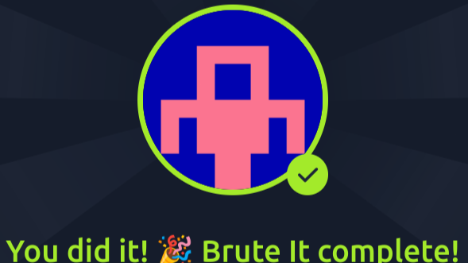


J'adore le concept du bruteforce. C'est un peu le degré 0 de la subtilité mais j'aime ce que ça dit des automatismes qu'on a toutes et tous quand il s'agit de définir des mots de passe par exemple. On a beau savoir qu'il faut allonger les mots de passe, utiliser des phrases, des caractères spéciaux, des chiffres, des majuscules etc et, pourtant, on en reste à un bon vieux motdepasse1! parce que c'est ce qui nous tombe sous la main. 


Quand on parcourt les leaks de mots de passe les plus populaires, ça saute aux yeux. Prenons un exemple avec la fameuse liste rockyou.txt (une célèbre liste de plus de 1 millions de mots de passe leakée en 2009). Si je filtre cette liste pour ne garder que celles qui se terminent par un chiffre suivi de ! ou ?, j'obtiens 21 388 résultats. Et regardez ce screen des premiers qui tombent, c'est du très basique ! Si vous y reconnaissez le vôtre, vous savez ce qu'il vous reste à faire ! 


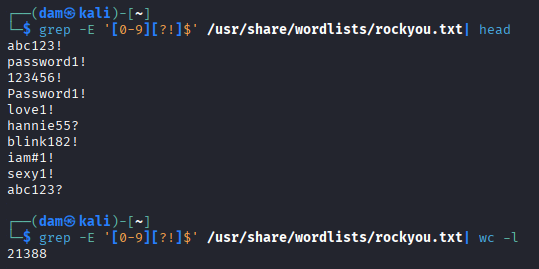
  
Bref, cette room promet du bruteforce donc on peut s'attendre à utiliser des wordlists (rockyou n'est pas toujours la plus efficiente à cause de sa taille démentielle) avec hydra ou ffuf, on va voir ça ! 


Les premières questions se résolvent aisément avec un les bons flags pour Nmap. 


*How many ports are open? * 
*What version of SSH is running?* 
*What version of Apache is running?* 
*Which Linux distribution is running?* 

 


Pour le premier, ce sera -p- pour passer tous les ports, quant aux autres, -sV pour la version des services détectés et -O pour la version. Je lance un SYN scan classique en bypassant la résolution DNS (-n) et je pipe tout ça dans un fichier histoire d'y revenir quand je veux. 


```
nmap -sS -sV  -O -p- -n -T4 10.10.250.28 > nmap && cat nmap
```


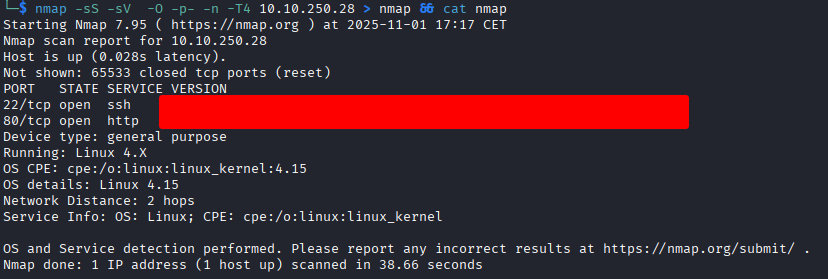
  


*Search for hidden directories on web server.What is the hidden directory?* 

 


On reste sur de l'énumération très classique, ça sent le dossier admin, images, script, assets ou un truc du genre. Un scan Gobuster basique devrait donner la réponse. Vu la difficulté de la room, la wordlist common.txt fera l'affaire. 


```
gobuster dir -u http://10.10.250.28 -w /usr/share/wordlists/seclists/Discovery/Web-Content/common.txt
```


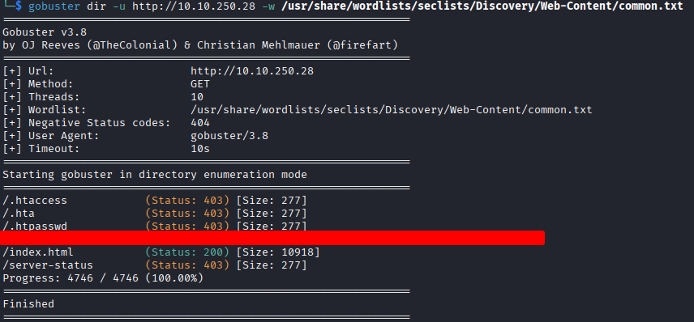
  
La page nous renvoie vers un simple formulaire de login classique mais on n'a ni user ni mot de passe pour le moment. On pourrait s'amuser à bruteforcer les deux mais on passerait de n tentatives avec seulement les mots de passe à n² !  


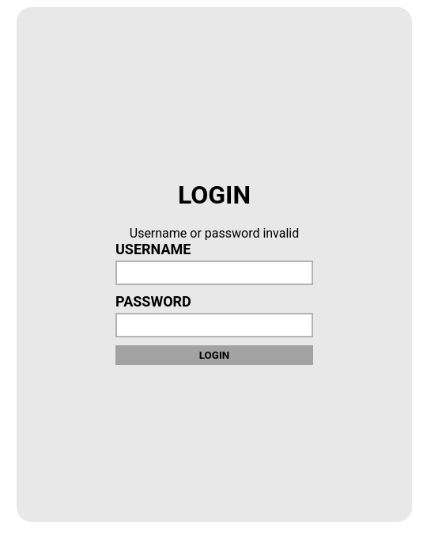
  


*What is the user:password of the admin panel?* 

 


Toujours commencer par F12 et voir s'il y a des commentaires oubliés (on est dans une room facile, je le rappelle). Et... bingo : "admin" (sans blague). 


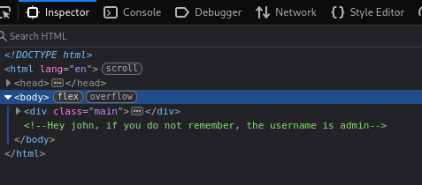
  
Pour utiliser correctement Hydra, j'ai besoin de voir quelle est la forme exacte de la requête, le message d'erreur et, éventuellement, la taille de la réponse. Avec ces indices, je pourrai bruteforcer et mettre de côté toutes les erreurs pour ne garder que la bonne réponse. 


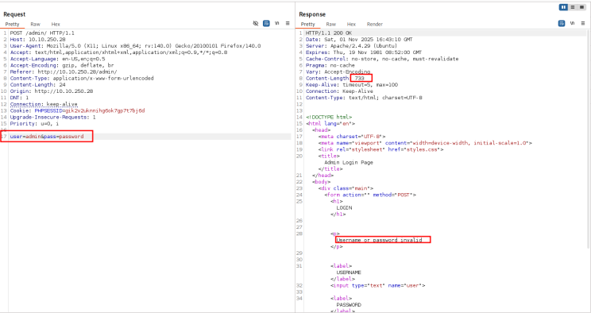
  
Hydra est très puissant mais aussi assez pénible à paramétrer. J'ai passé pas mal de temps à lancer des recherches qui me balançaient des faux positifs. En fait, je faisais une erreur tellement bête que je m'en suis voulu en inscrivant /admin:user et non /admin/:user alors que le slash était bien inscrit dans la requête de Burpsuite. Pas grave, je le retiendrai d'autant mieux pour les fois suivantes que je l'ai inscrit ici.  


Entre temps, j'ai un peu rusé. La réponse attendue dans le formulaire est du type *****:****** ce qui signifie qu'on attend un mot de passe de 6 caractères seulement. Idéal pour réduire le fichier rockyou et éviter des requêtes inutiles, j'ai donc créé un document avec uniquement les pass de 6 caractères avec grep + regex. 


```
grep -P '^.{6}$' /usr/share/wordlists/rockyou.txt > rock6.txt
```


```
hydra -l admin -P ./rock6.txt 10.10.250.28 http-post-form "/admin/:user=^USER^&pass=^PASS^:F=invalid"
```


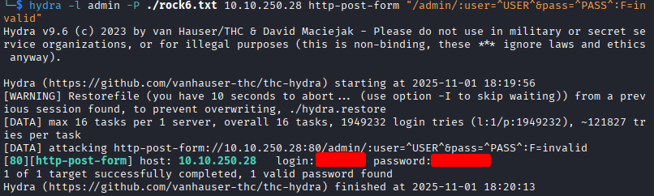
  


*Web flag* 

 


On se connecte avec les identifiants pour récupérer le flag de la dernière question ainsi que la clé privée RSA qui va nous servir à nous connecter via SSH. 


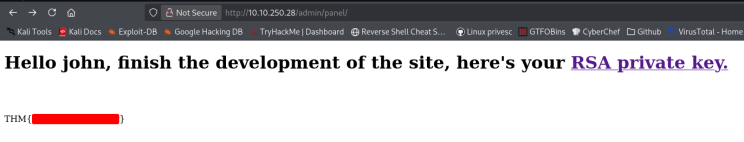
  
Sauf que la clé est cryptée et john (the ripper) ne peut pas traiter cette clé en l'état : il faut la transformer dans un format qu'il est capable de gérer. Pour cela, rien de plus simple, il suffit d'utiliser ssh2john. Une fois que ce sera fait, john retrouvera (par bruteforce évidemment) la passphrase.  


*Crack the RSA key you found.What is John's RSA Private Key passphrase?* 

 


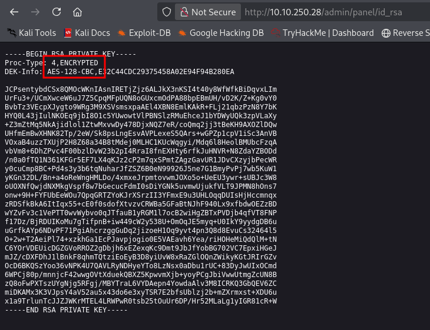
  
```
ssh2john id_rsa > id_rsa.hash
```


Les questions de la page tryhackme permettent de nouveau de gagner un peu de temps. On sait que la passphrase fait 10 caractères de long. J'adapte la commande de tout à l'heure avec {10} au lieu de {6} avant d'utiliser john. 


```
grep -P '^.{10}$' /usr/share/wordlists/rockyou.txt > rock10.txt
```


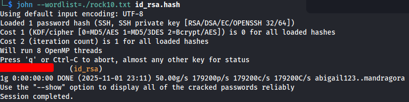
  


*user.txt* 

 


Maintenant qu'on a la passphrase, on peut se connecter et récupérer le flag user.txt 


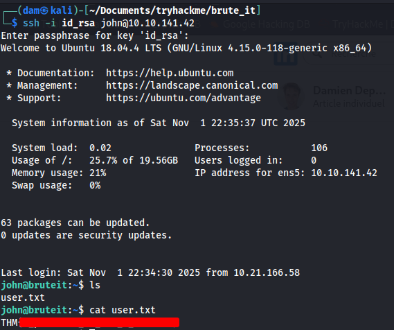
  


*Find a form to escalate your privileges.What is the root's password?* 

 


Maintenant, il faut trouver le flag root ainsi que le mot de passe du compte root. Ca tombe bien : sudo -l nous indique qu'on peut utiliser cat avec les privilèges sudo. J'en profiterais bien pour aller directement chercher le /root/root.txt mais on va jouer le jeu et cracker le mot de passe du compte root puisqu'on nous le demande. J'affiche donc la ligne dédiée dans le fichier /etc/shadow 


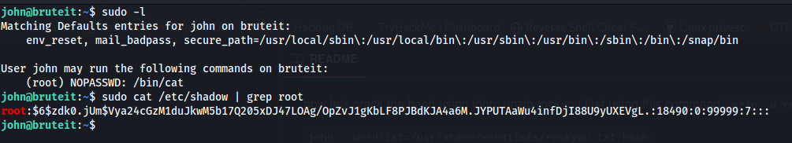
  
Le $6$ en début de ligne permet de trouver l'algorithme de hashage :  sha512crypt qui correspond à l'option 1800 dans hashcat. Je copie la ligne dans un fichier que j'appelle "root" puis j'utilise hashcat pour casser ce hash. Comme j'ai tout gardé dont le nom d'utilisateur, j'ajoute le flag --username. 


```
hashcat -m 1800 --username -a 0 root /usr/share/wordlists/rockyou.txt
```


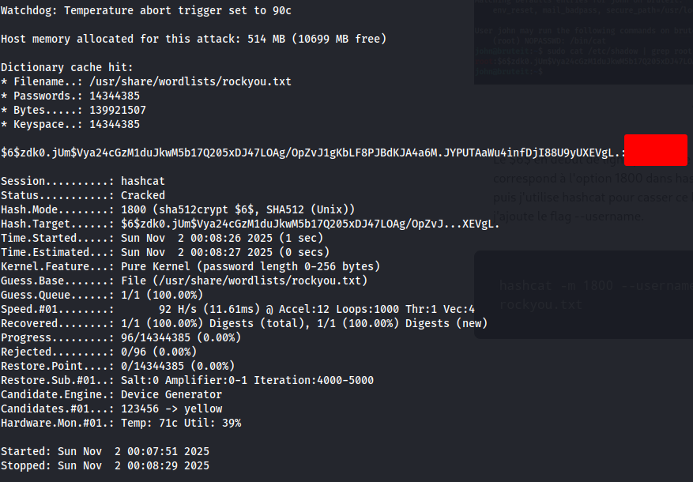
  


*root.txt* 

 


Je change d'utilisateur, navigue dans le répertoire et récupère le flag ! 


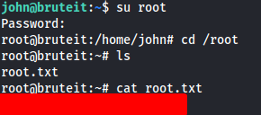
  
Et voilà ! Une room très clichée mais qui permet d'utiliser les grands classiques et de revoir un peu de syntaxe. Parfait pour un débutant qui commence à se débrouiller avec ces outils ! 


