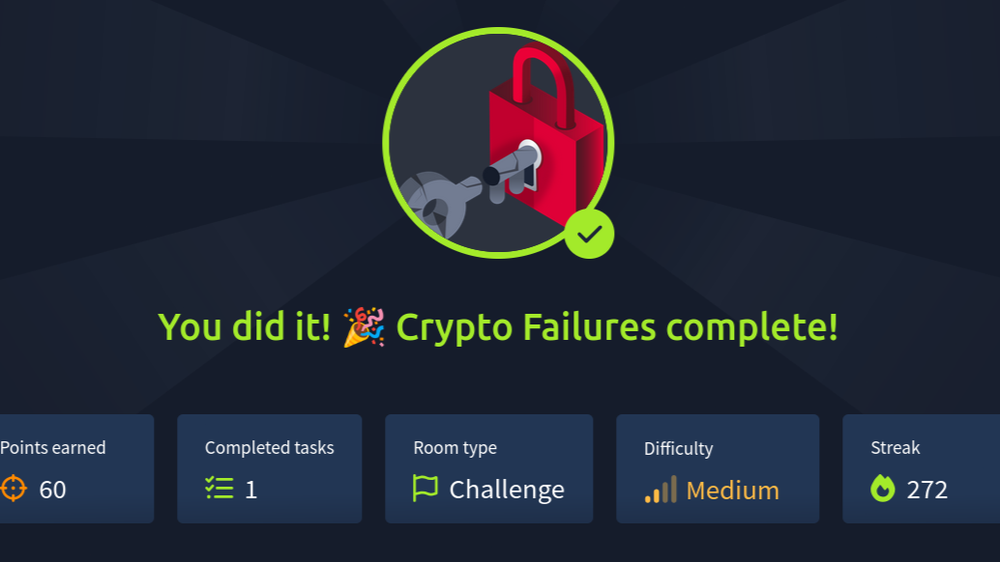
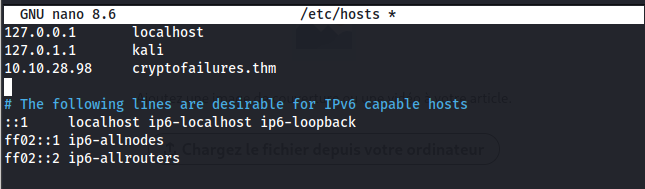
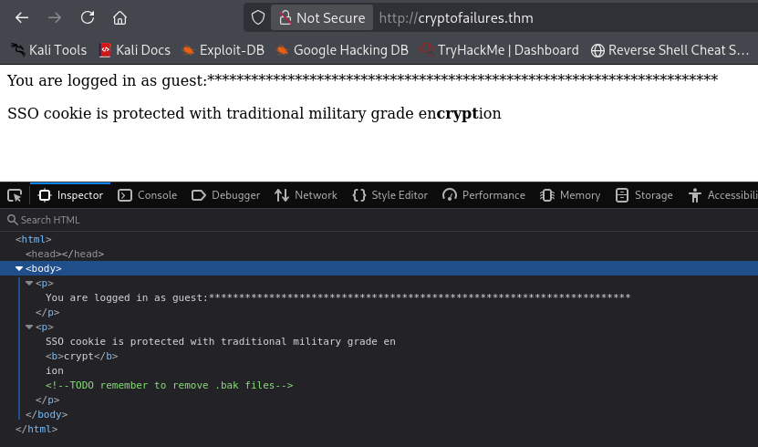
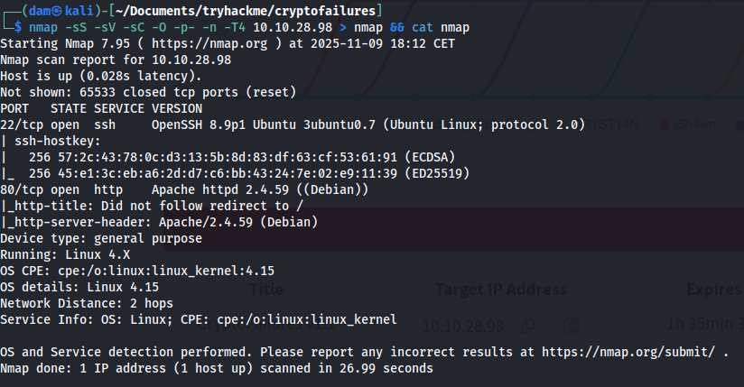
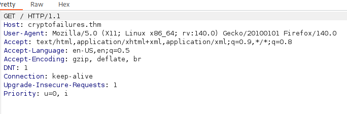
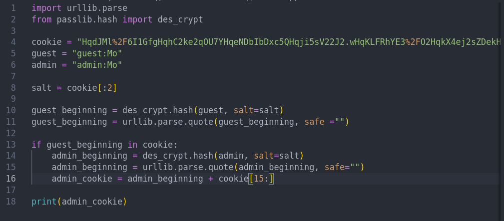
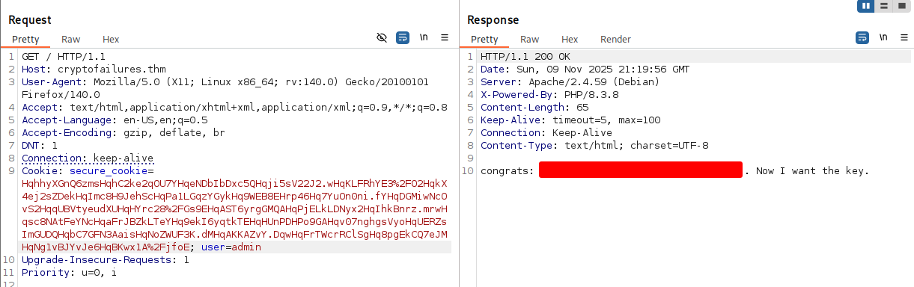
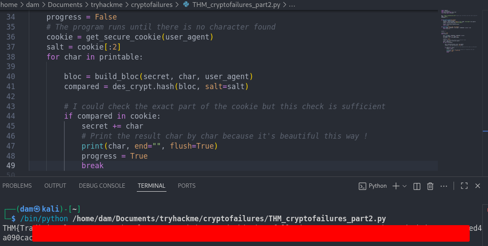

<div align="center">

# **WriteUp/Guide [FR] - TryHackMe : Crypto Failures**

</div>

**Author:** [Damien D.](https://fr.linkedin.com/in/damien-d-9816121a9)

---




Très peu d'informations disponibles sur [la page d'accueil](https://www.linkedin.com/redir/redirect?url=https%3A%2F%2Ftryhackme%2Ecom%2Froom%2Fcryptofailures&urlhash=2wrJ&trk=article-ssr-frontend-pulse_little-text-block), on sait tout au plus qu'il sera question de cryptographie. Le sujet est vaste et peut vite devenir complexe. La room étant indiquée comme medium, je m'attends à un défi assez intéressant alors allons-y ! [SPOILER ALERT : c'était difficile !] 


Commençons d'abord par mettre à jour le fichier /etc/hosts pour faire les choses proprement, c'est une bonne habitude. 


```
sudo nano /etc/hosts
```



  
Je me connecte et regarde la console avec F12. On y trouve déjà une indication intéressante avec la mention d'un fichier de backup oublié. Je le note pour le scan gobuster. 



  
De la même manière, il est question d'un cookie sécurisé qu'on peut consulter dans la partie storage. Il est question d'un "military grade encryption" (avec "crypt" en gras, peut-être un indice) donc probablement un chiffrement AES-256 (comme indiqué [ici](https://www.linkedin.com/redir/redirect?url=https%3A%2F%2Fnordpass%2Ecom%2Fblog%2Fmilitary-grade-encryption-explained%2F&urlhash=GORC&trk=article-ssr-frontend-pulse_little-text-block)) 


  
Le scan Nmap ne donne rien que du très classique. Une page web sur le port 80 et un accès ssh sur le port 22. 


```
nmap -sS -sV -sC -O -p- -n -T4 10.10.28.98 > nmap && cat nmap
```



  
Quant à gobuster, chose promise, chose due : on a bien un fichier .bak accessible. 


```
gobuster dir -u http://cryptofailures.thm -w /usr/share/wordlists/seclists/Discovery/Web-Content/common.txt -x bak
```


  
Et le fichier est très intéressant puisqu'il nous donne la recette de fabrication du cookie. Merci les heures passées à apprendre python, grâce à elles, je peux comprendre ce script. 


```
<?php
include('config.php');

function generate_cookie($user,$ENC_SECRET_KEY) {
    $SALT=generatesalt(2);
    
    $secure_cookie_string = $user.":".$_SERVER['HTTP_USER_AGENT'].":".$ENC_SECRET_KEY;

    $secure_cookie = make_secure_cookie($secure_cookie_string,$SALT);

    setcookie("secure_cookie",$secure_cookie,time()+3600,'/','',false); 
    setcookie("user","$user",time()+3600,'/','',false);
}
```


La fonction principale va générer le cookie. Pour cela, elle va avoir besoin d'un nom d'utilisateur ($user), une variable globale ($ENC_SECRET_KEY) qui se trouve dans un autre fichier : config.php et une variable superglobale fournie par le serveur directement ([https://www.php.net/manual/fr/language.variables.superglobals.php](https://www.linkedin.com/redir/redirect?url=https%3A%2F%2Fwww%2Ephp%2Enet%2Fmanual%2Ffr%2Flanguage%2Evariables%2Esuperglobals%2Ephp&urlhash=BWKu&trk=article-ssr-frontend-pulse_little-text-block)).  


La première étape est de générer un salt via une fonction dédiée et on voit que le nombre n est hardcodé (2). Ensuite, on réunit différentes infos pour créer une string qui va servir de variable avec le salt pour une autre fonction "make_secure_cookie". Enfin, la fonction setcookie est une fonction de base de php qui définit un cookie avec ses headers (d'où la notion de temps avec ce 3600 (qui correspond à une durée de validité d'une heure). Le false correspond au paramètre "secure", ce qui signifie qu'il est transmis via le protocole HTTP et non HTTPS. Pas très prudent pour une donnée aussi sensible... Pour en savoir plus : [https://www.php.net/manual/fr/function.setcookie.php](https://www.linkedin.com/redir/redirect?url=https%3A%2F%2Fwww%2Ephp%2Enet%2Fmanual%2Ffr%2Ffunction%2Esetcookie%2Ephp&urlhash=IrpU&trk=article-ssr-frontend-pulse_little-text-block) 


```
function cryptstring($what,$SALT){

return crypt($what,$SALT);

}
```


Ici on a une fonction cryptstring qui met en forme une string en appelant une fonction de base de php : "crypt" qui nécessite une string et un salt. Pour en savoir plus : [https://www.php.net/manual/en/function.crypt.php](https://www.linkedin.com/redir/redirect?url=https%3A%2F%2Fwww%2Ephp%2Enet%2Fmanual%2Fen%2Ffunction%2Ecrypt%2Ephp&urlhash=xjQY&trk=article-ssr-frontend-pulse_little-text-block) 


```
function make_secure_cookie($text,$SALT) {

$secure_cookie='';

foreach ( str_split($text,8) as $el ) {
    $secure_cookie .= cryptstring($el,$SALT);
}

return($secure_cookie);
}
```


La fonction principale, la voici : elle prend en argument un texte (celui généré par la première fonction : le cookie) et le salt. Le cookie est coupé en blocs de 8 caractères et pour chaque section, la fonction appelle crypt qui requiert le salt. Tout cela permet de produire le "secure_cookie", une chaîne de caractères.  


```
function generatesalt($n) {
$randomString='';
$characters = '0123456789abcdefghijklmnopqrstuvwxyzABCDEFGHIJKLMNOPQRSTUVWXYZ';
for ($i = 0; $i < $n; $i++) {
    $index = rand(0, strlen($characters) - 1);
    $randomString .= $characters[$index];
}
return $randomString;
}
```


Enfin, la fonction qui génère ce fameux salt qui choisit un nombre n de caractères au hasard dans la liste. Comme on l'avait vu, le salt ne contiendra que 2 caractères, ce qui est très peu... 


```
function verify_cookie($ENC_SECRET_KEY){


    $crypted_cookie=$_COOKIE['secure_cookie'];
    $user=$_COOKIE['user'];
    $string=$user.":".$_SERVER['HTTP_USER_AGENT'].":".$ENC_SECRET_KEY;

    $salt=substr($_COOKIE['secure_cookie'],0,2);

    if(make_secure_cookie($string,$salt)===$crypted_cookie) {
        return true;
    } else {
        return false;
    }
}
```


La suite nous est moins utile dans l'immédiat mais on y comprends que la longueur des *** sur la page d'accueil dépend d'une variable globale et qu'il y a un compte "admin". S'il n'y a pas de cookie, le serveur nous en attribue un ainsi que le statut de guest. 


```
if ( isset($_COOKIE['secure_cookie']) && isset($_COOKIE['user']))  {

    $user=$_COOKIE['user'];

    if (verify_cookie($ENC_SECRET_KEY)) {
        
    if ($user === "admin") {
   
        echo 'congrats: ******flag here******. Now I want the key.';

            } else {
        
        $length=strlen($_SERVER['HTTP_USER_AGENT']);
        print "<p>You are logged in as " . $user . ":" . str_repeat("*", $length) . "\n";
	    print "<p>SSO cookie is protected with traditional military grade en<b>crypt</b>ion\n";    
    }

} else { 

    print "<p>You are not logged in\n";
   

}

}
  else {

    generate_cookie('guest',$ENC_SECRET_KEY);
    
    header('Location: /');


}
?>
```


Histoire d'y voir plus clair, j'essaie de comprendre comment est composé le cookie qui m'est attribué : gE8Z55HjrmQ.YgEAKLycM5CQR2gEF95vETcdyMYgE7Eqzo9rs3lIgEXaRHiR67YJ.gEcecHes0LCNcgEKu3V.dNMUrIgE0CeZUniFAvYgEcxBpKZNMjP2gEcp8Eq7sDhBsgEMa35MTbCHs2gE6QNDiiycz4IgEK9ZVC2BnBtwgEOp5.OEH5Q2ogENNOacjTPxsogEzqqljo7lkgIgEVPZrSyiskVAgEEXZugfoR1wMgEDETU3rrV.AQgEnRK.Cq6.w4EgE7%2FWwJaIZ4nEgEjeWcglXbwCE 


On sait, grâce au script php, que le début de la chaine de caractères qui est cryptée a cette forme : user:user_agent:secret_key et, si je ne connais pas la clé, je connais le reste. Je commence par intercepter le user agent avec Burp. 



  


*What is the value of the web flag?* 

 


On peut déduire le salt des deux premiers caractères de notre cookie. J'ai fait un petit script en python qui permet de générer le début du cookie. Logiquement, la partie suivante utilise la même clé donc il n'y a qu'à modifier le début pour obtenir le cookie "admin". J'adapte donc mon code avec le user comme "admin". 



  
[Vous pouvez télécharger mon script ici : MERCI DE METTRE UNE ETOILE](https://www.linkedin.com/redir/redirect?url=https%3A%2F%2Fgithub%2Ecom%2FDamECP%2FTHM_cryptofailures&urlhash=bpXb&trk=article-ssr-frontend-pulse_little-text-block) 


Pour celles et ceux que ça intéresse, j'explique rapidement le fonctionnement. Je remplace la première section de 8 caractères avec admin à la place de guest (5 caractères chacun, ça tombe bien) et j'isole le salt. 


La fonction crypt étant considéré comme insécure, elle n'est plus dans ma verison de python (3.13) mais on peut la retrouver via passlib.hash et sa fonction des_crypt. Je l'utilise donc sur les deux sections : la valeur attendue avec guest (qui permet de contrôler en amont) et celle d'admin. Ensuite, j'isole la suite du cookie que je viens concaténer à mon résultat. Rien de bien méchant mais ça n'a pas marché immédiatement à cause de certains caractères qui étaient interprétés ("%2" = "/"). J'ai donc dû passer par urllib pour éviter cela. 



  
J'ai préféré passer par Burpsuite pour le screenshot mais on obtient le même résultat en changeant les valeurs dans la console directement. Quoiqu'il en soit, on a la première réponse et on peut passer à la suite : trouver la clé (et ça va être bien plus compliqué, j'ai mis une semaine pour comprendre et réécrire le code). 


*What is the encryption key?* 

 


Le cookie est construit à partir du user agent et comme il ne s'agit de rien d'autre que d'une chaine de caractères, on peut le manipuler. Ensuite, la chaine "guest:" a une longueur de 6 caractères, ce qui signifie que si on a un user agent vide, on obtient "guest::" (7 caractères). 


Là où ça devient intéressant, c'est que l'algorithme utilisé a deux failles :  


le salt est généré à chaque requête mais il est facilement identifiable puisqu'il est au début du hash de chaque bloc. 
la fonction crypt découpe la chaine en bloc de 8 octets donc ici 8 caractères 

 


Cela signifie que le premier caractère du secret peut être déduit du hash produit si on le bruteforce avec tous les caractères possibles (une centaine). 


```
guest::$
```


En connaissant les 7 premiers caractères, on n'a qu'à bruteforcer le 8ème ($) et voir si la section encodée est dans le cookie généré par le serveur. Ca, c'est relativement simple et ça ne m'a demandé qu'une petite heure de test. En revanche, la suite a été plus compliquée ! 


```
import requests
import urllib.parse
from passlib.hash import des_crypt
from string import printable


URL = "http://cryptofailures.thm" #update your /etc/hosts with the room's given IP
USER = "guest"
SEPARATOR = ":"
BLOC_SIZE = 8 # the server cut the str in 8 characters long parts
CRYPTED_SIZE = 13 # the returned hash is 13 characters long


def get_secure_cookie(user_agent):
    session = requests.Session()
    response = session.get(URL, headers={"user":USER, "User-Agent":user_agent})
    cookie = session.cookies.get("secure_cookie")
    #avoids interpreted characters
    cookie = urllib.parse.unquote(cookie)
    return cookie

def build_bloc(secret, char, user_agent):
    bloc = USER + SEPARATOR + user_agent + SEPARATOR + secret + char
    return bloc[-8:]
```


J'ai commencé par adapter le code de la première partie. Comme il va être question de reconstruire sans cesse la chaine de caractères et la comparer au cookie (qui changera à chaque appel sur le serveur grâce au  salt généré aléatoirement), j'ai créée une fonction qui génère le cookie pour rendre tout ça plus propre.  


La seconde fonction quant à elle renvoie les 8 derniers caractères de la chaine à hasher, c'est le coeur de la fonction puisque c'est au bout de celle-ci qu'on va retrouver le caractère testé pour chaque occurrence. Maintenant qu'on a ça, il faut faire une boucle pour trouver tous les caractères du secret. 


```
secret = ""

progress = True
while progress:
    progress = False

    base = len(USER + SEPARATOR + SEPARATOR + secret)
    user_agent_length = (7 - base) % 8
    user_agent = "X" * user_agent_length

    cookie = get_secure_cookie(user_agent)
    salt = cookie[:2]

    for char in printable:

        bloc = build_bloc(secret, char, user_agent)
        compared = des_crypt.hash(bloc, salt=salt)

        if compared in cookie:
            secret += char
            print(char, end="", flush=True)
            progress = True
            break
```


Je commence par mettre un flag qui servira à interrompre le script quand il n'y aura plus de nouveau caractère trouvé. Ensuite le user agent est construit de manière à ce que le caractère testé soit toujours le 8ème d'une chaine de caractères déjà connus (des X dans mon cas). 


A chaque itération, le scipt génère un nouveau cookie et itère ensuite tous les caractères à tester à l'extrémité de notre user agent. Si le hash généré est présent dans le cookie, on le valide et on avance. 


J'ai vu d'autres codes plus précis sur certains blogs qui comparaient l'emplacement précis du hash au sein du cookie mais comme on a affaire à une séquence de 13 caractères avec un salt différent à chaque fois, il y a une chance infime d'avoir un doublon et donc une erreur. Le mieux est l'ennemi du bien, le code fonctionne. 



  
Encore une fois, [le code est disponible sur mon github](https://www.linkedin.com/redir/redirect?url=https%3A%2F%2Fgithub%2Ecom%2FDamECP%2FTHM_cryptofailures&urlhash=bpXb&trk=article-ssr-frontend-pulse_little-text-block). Merci de penser aux étoiles si vous y avez recours ou si vous voulez juste m'encourager/me remercier ! 


Et c'est terminé pour cette fois ! Room vraiment formatrice malgré un nombre de points famélique (60 à peine). Après une première question relativement simple, la seconde était bien plus difficile sans quelques bases en code. Merci encore mon autoformation en python l'année dernière ! 


