

# **WriteUp/Guide [FR] - TryHackMe : Easy Peasy**

**Author:** [Damien D.](https://fr.linkedin.com/in/damien-d-9816121a9)

---

*How many ports are open?* 
*What is the version of nginx?* 
*What is running on the highest port?* 

 

Les trois premières questions peuvent se résoudre via un simple scan Nmap. J'utilise donc ma configuration habituelle dont voici les flags : 

-sS lance un SYN scan (plutôt rapide) 
-sV permet de trouver les versions des services découverts 
-p- sert à scanner tous les ports 
-n évite la résolution DNS ce qui rend le scan légèrement plus rapide (essentiel quand on fait un scan de tous les ports) 
-T4 accélère le travail mais peut déclencher des IDS. Pour une room de ce type, ce n'est pas un problème 

 

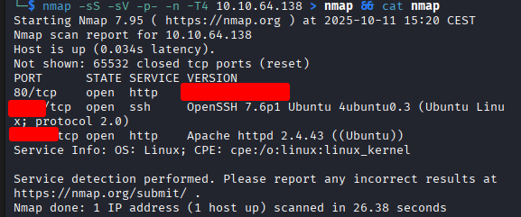
  

*Using GoBuster, find flag 1.* 

 

La visite sur la page web du port 80 ne donne rien de bien intéressant. Il faut donc passer par un scan Gobuster histoire de voir s'il y a des répertoires pertinents. Même chose, pour une première passe, j'utilise la wordlist common.txt qui a le mérite d'être assez rapide. 

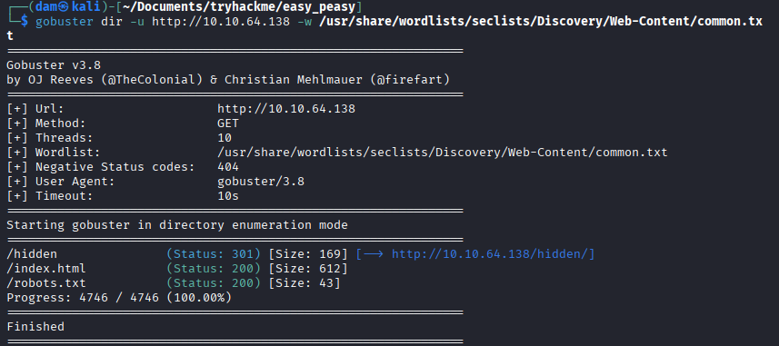
  
En se rendant sur l'endpoint indiqué, on avance. Un simple background et rien d'intéressant en utilisant l'inspecteur avec F12. Comme il est question d'énumération, c'est assez simple, on va repartir d'ici. J'envisage d'abord une recherche récursive avec FFUF mais je me décide à faire les choses pas à pas dans un premier temps. 

  
L'onglet prend le nom "dead end". A priori, il ne sera pas très utile de passer par la récursion. En revanche, le F12 donne quelque chose cette fois avec une chaine de caractères qui sent la base64. 

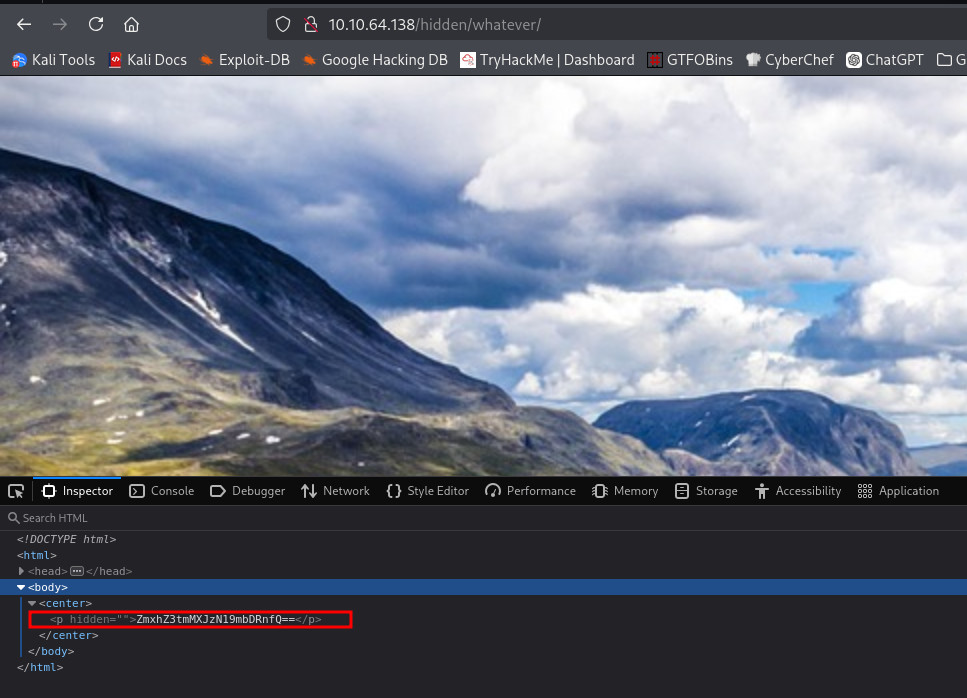
  
Et en effet, on a notre premier flag. 

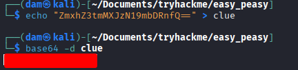
  

*Further enumerate the machine, what is flag 2?* 

 

Pour le second flag, on nous dit qu'on doit continuer d'énumérer. Comme on en a fini sur le port 80, il est temps de s'intéresser aux deux autres ports. On laisse le ssh de côté pour le moment (la logique voudrait qu'on trouve d'abord un nom d'utilisateur et un mot de passe ou une clé) pour s'intéresser au port 65524. La page en elle-même ne donne rien alors je relance un scan gobuster. 

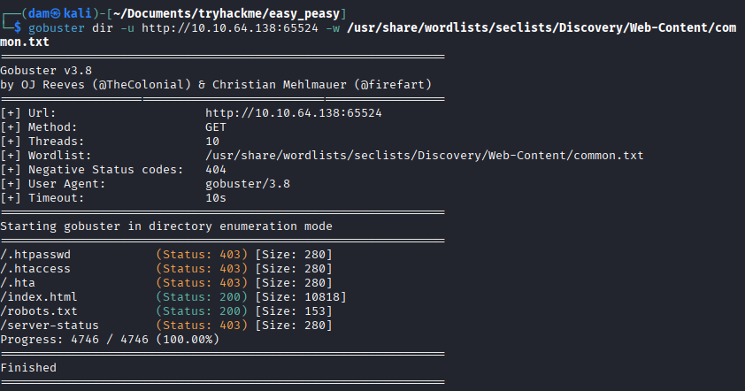
  
Rien de vraiment original, je regarde le robots.txt, sait-on jamais, et là... 

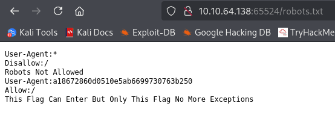
  
On nous donne une indication pour le User-agent mais c'est une fausse piste. J'ai essayé de le modifier en utilisant Curl et Burpsuite mais la page Apache reste la même.  En y regardant de plus près, on peut comprendre que c'est du MD5 (32 caractères en hexadécimal), ce qui se confirme ici. 

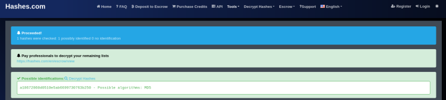
  
Et on arrive à la première frustration de la room puisque le user-agent ne sert littéralement à rien. Après avoir fouillé les sites classiques du type crackstation, je finis par en trouver un qui contient la réponse dans sa base de données. Sauf qu'il n'y a aucune raison que cette suite de caractère se trouve dans une rainbow table. J'ai l'impression que la réponse n'est pas très légitime, si vous avez des pistes, je prends. 

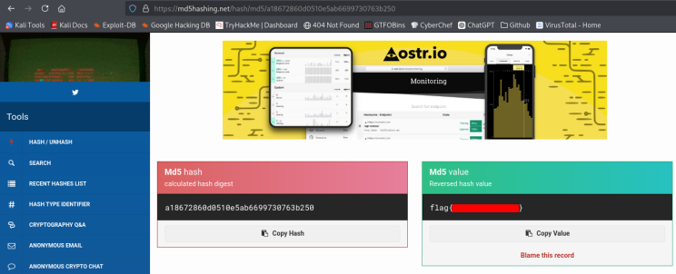
  

*Crack the hash with easypeasy.txt, What is the flag 3?* 

 

Pour la question suivante, idem. Je pensais que le changement de user-agent avait une conséquence mais non, le flag est bel et bien visible dans la page en clair. Le seul intérêt que je trouve à tout ça est que ça exerce l'attention au détail mais c'est tout. 

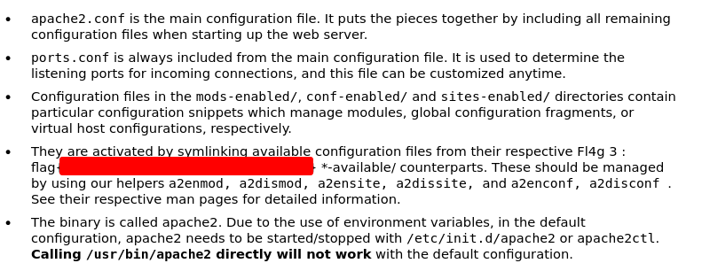
  

*What is the hidden directory?* 

 

La suite est un peu plus intéressante 

  
Quand j'avais testé le user-agent, j'étais passé par Curl et j'avais repéré cette ligne. Il est question de "ba...." (base64 ? 85? 32?) et d'une chaine de caractères. Je teste les "fromBase" et j'obtiens rapidement la réponse avec la base62. 

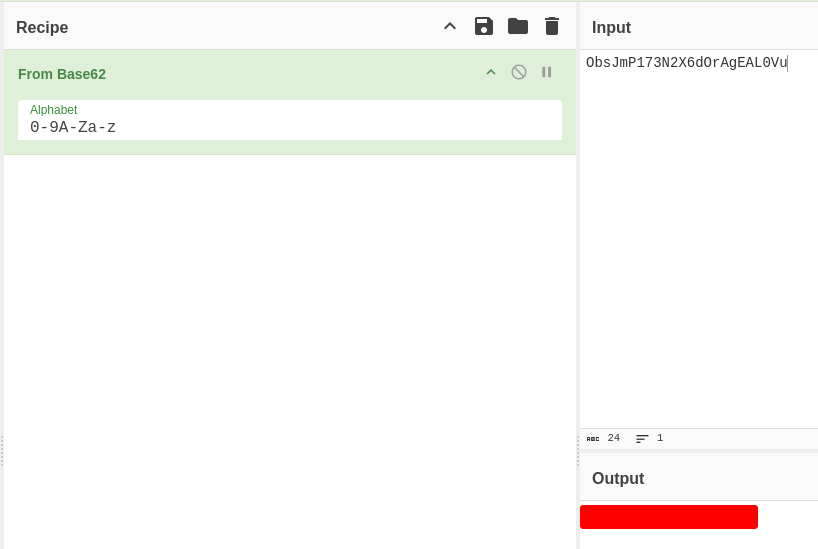
  

*Using the wordlist that provided to you in this task crack the hash, what is the password?* 

 

La nouvelle page sur laquelle on arrive ne semble rien donner a priori mais... Un F12 plus tard, on peut voir une nouvelle chaine de caractères à peine plaquée sur la page. Je l'ai surlignée sur le screenshot, quand on le sait, ça se voit facilement. 

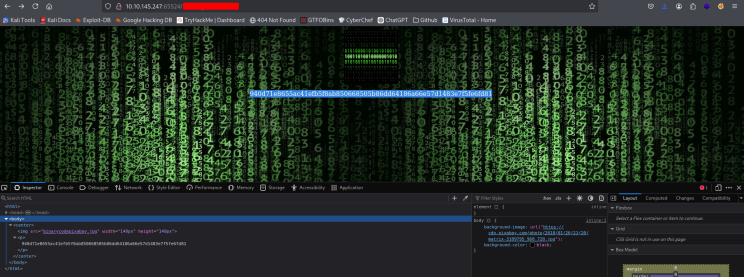
  
Cyberchef ne nous est d'aucune aide ici, il faut faire appel à l'indice donné dans la consigne. On y mentionne une wordlist fournie. En utilisant John, on obtient plusieurs résultats. 

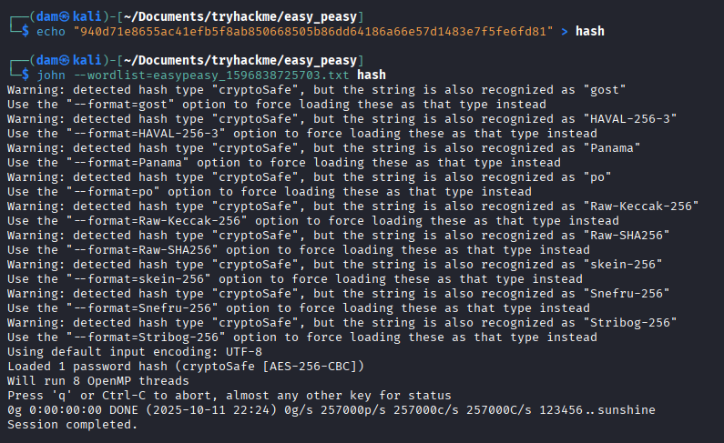
  
Là, j'ai mis un peu de temps à comprendre. Je cherchais un nouvel élément alors... qu'il n'y en avait pas. Contrairement à un escape game où les éléments ne servent qu'une fois, ici il faut réutiliser John sur le même hash. On utilise le "gost" qu'on avait trouvé comme format et on obtient le flag. 

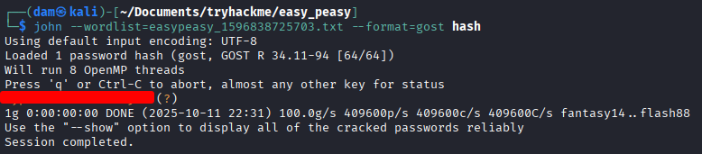
  

*What is the password to login to the machine via SSH?* 

 

Jusqu'ici, on a pu avancer en explorant des indices textuels mais il n'y a plus vraiment de piste. Cela dit, depuis le début, on a des images de fond qui ne sont pas si anodines. Je les avais stockées au fur et à mesure et j'ai commencé à regarder ça avec steghide. Après plusieurs échecs, c'est la petite image en binaire qui révèle quelque chose d'intéressant (et c'était logique car elle était elle-même "à part" sur la dernière page). 

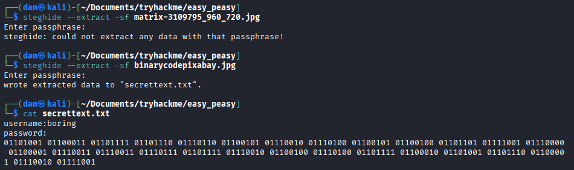
  
En utilisant le mot de passe de la question en guise de passphrase, on obtient un nom d'utilisateur et un mot de passe en binaire. Voilà notre accès SSH ! 

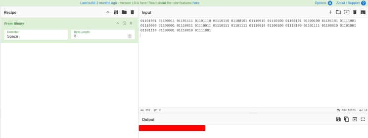
  

*What is the user flag?* 

 

Je me connecte avec les identifiants et le user.txt ne donne pas le flag directement. Cela dit, l'indice est clair : on parle de rotation et le premier mot a 4 caractères tout comme le classique "flag", on est donc devant un chiffrement César. 

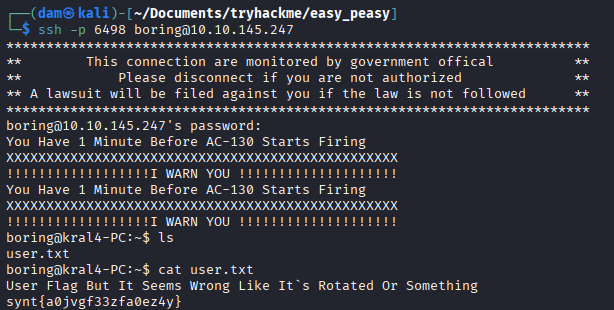
  
Et le site [dcode.fr](https://www.linkedin.com/redir/redirect?url=http%3A%2F%2Fdcode%2Efr&urlhash=V0Zp&trk=article-ssr-frontend-pulse_little-text-block) fait très bien le boulot ! 

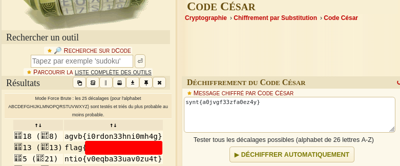
  

*What is the root flag?* 

 

Pour ce qui est du root, je n'ai pas vu de fichier SUID qui permette une élévation de privilèges grâce à GTFOBins. Option B : les crontabs. Encore une fois, c'était attendu vu le commentaire qui nous accueille sur le SSH. Un .sh en fichier caché se lance toutes les minutes, parfait pour un reverse shell très basique. Le fichier final est lui aussi caché mais il se trouve à l'endroit habituel. 

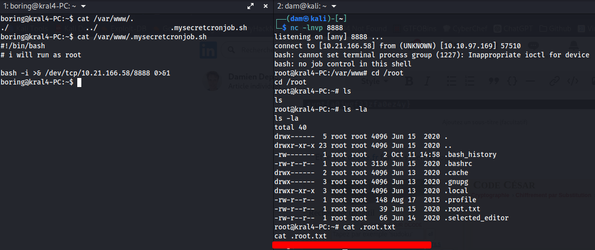
  
 Et voilà pour cette room ! C'était un petit parcours vraiment sympa, assez complet et bien rythmé. Je reste un peu sur ma faim avec cette histoire de user-agent et ce hash bizarre mais on fait avec ! 

