<div align="center">

# **WriteUp/Guide [FR] - TryHackMe : Game zone**

</div>

**Author:** [Damien D.](https://fr.linkedin.com/in/damien-d-9816121a9)

---

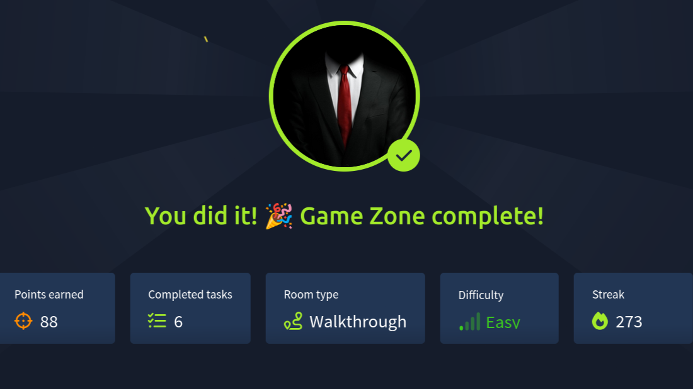


J'avais beaucoup aimé la room dédiée à Goldeneye ([dont mon précédent writeup se trouve ici](https://www.linkedin.com/pulse/writeup-fr-tryhackme-goldeneye-damien-depaepe-kbike/?trk=article-ssr-frontend-pulse_little-text-block)) alors je me suis laissé tenter par ce petit logo de Hitman, série de jeux sur laquelle j'ai passé pas mal d'heures ! La présentation de [la room du jour](https://www.linkedin.com/redir/redirect?url=https%3A%2F%2Ftryhackme%2Ecom%2Froom%2Fgamezone&urlhash=WfHT&trk=article-ssr-frontend-pulse_little-text-block) donne déjà pas mal d'indications sur ce qu'on va devoir faire et les outils à utiliser :  


Injection SQL (manuelle ou via SQLmap) 
Crackage d'un hash de mot de passe utilisateur 
Tunneling SSH 
Utilisation de Metasploit 

 


Je commence par mettre à jour mon fichier /etc/hosts et je lance en même temps un scan Nmap dont je garde la trace dans un fichier dédié. 


```
map -sS -sV -sC -O -p- -n -T4 10.10.35.197 > nmap && cat nmap

Starting Nmap 7.95 ( https://nmap.org ) at 2025-11-16 12:19 CET
Nmap scan report for 10.10.35.197
Host is up (0.027s latency).
Not shown: 65533 closed tcp ports (reset)
PORT   STATE SERVICE VERSION
22/tcp open  ssh     OpenSSH 7.2p2 Ubuntu 4ubuntu2.7 (Ubuntu Linux; protocol 2.0)
| ssh-hostkey: 
|   2048 61:ea:89:f1:d4:a7:dc:a5:50:f7:6d:89:c3:af:0b:03 (RSA)
|   256 b3:7d:72:46:1e:d3:41:b6:6a:91:15:16:c9:4a:a5:fa (ECDSA)
|_  256 53:67:09:dc:ff:fb:3a:3e:fb:fe:cf:d8:6d:41:27:ab (ED25519)
80/tcp open  http    Apache httpd 2.4.18 ((Ubuntu))
|_http-title: Game Zone
| http-cookie-flags: 
|   /: 
|     PHPSESSID: 
|_      httponly flag not set
|_http-server-header: Apache/2.4.18 (Ubuntu)
Device type: general purpose
Running: Linux 4.X
OS CPE: cpe:/o:linux:linux_kernel:4.4
OS details: Linux 4.4
Network Distance: 2 hops
Service Info: OS: Linux; CPE: cpe:/o:linux:linux_kernel

OS and Service detection performed. Please report any incorrect results at https://nmap.org/submit/ .
Nmap done: 1 IP address (1 host up) scanned in 32.07 seconds
```


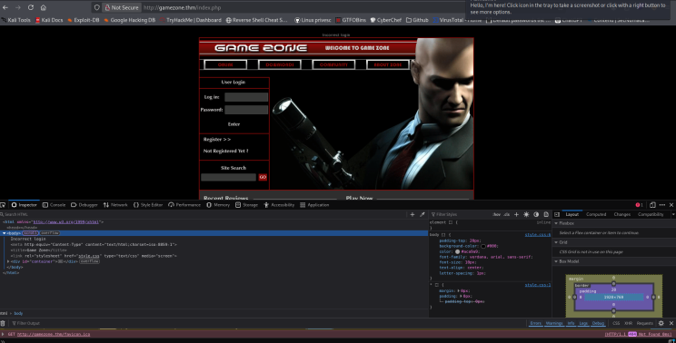
  


*What is the name of the large cartoon avatar holding a sniper on the forum ?* 

 


La réponse est assez évidente mais si le jeu ne vous dit rien, cherchez simplement le numéro de cet agent sur [la page wikipedia de la série Hitman](https://fr.wikipedia.org/wiki/Hitman_(s%C3%A9rie_de_jeux_vid%C3%A9o)?trk=article-ssr-frontend-pulse_little-text-block). 


La page du site contient différents onglets mais ils sont inactifs. Le moteur de recherche ne renvoie rien mais y faire une recherche modifie l'url avec ce qui ressemble à des coordonnées. J'essaie de les modifier mais ça ne donne rien. 


```
http://gamezone.thm/index.php?x=0&y=0#
```


En testant un nom d'utilisateur au hasard, on obtient la réponse du serveur en cas d'erreur d'identification : Incorrect login. La suite logique : essayer de faire un compte sur la plateforme mais le register nous renvoie vers /index.php et rien de plus. 


Je tente à la main le classique ' OR 1 = 1 -- qui ne donne rien mais je me souviens d'une autre room où il fallait ajouter un -. J'entre donc dans la partie log in la chaine suivante et ça marche ! 


```
' OR 1=1 -- -
```


Et comme j'ai cherché de mon côté, je ne me suis pas rendu compte que la page THM donnait carrément la réponse. Gros point négatif : en termes de pédagogie, c'est naze. Donner, ce n'est pas aider. 


*When you've logged in, what page do you get redirected to?* 

 


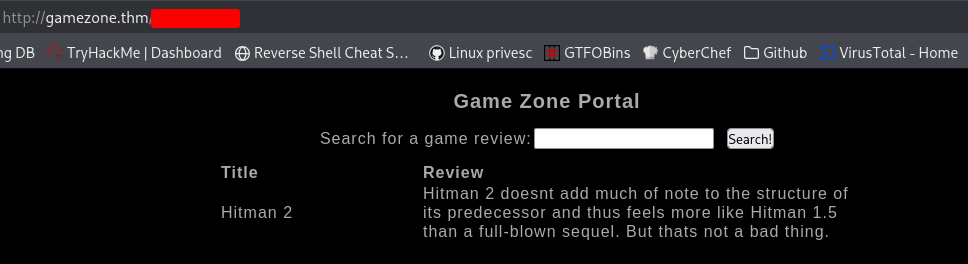
  
Je lance une recherche "Hitman" et la page nous renvoie une courte critique du jeu. J'essaie quelques autres noms qui ne donnent rien mais ce n'est pas bien grave. L'important ici c'est de constater qu'il doit y avoir une base de données derrière cette page. On voit bien une catégorie "Title" et une autre "Review" mais il y a peut-être plus que ça et peut-être même d'autres tables dont des tables d'utilisateurs puisqu'il y avait un onglet "community" sur la page d'accueil. C'est ici que SQLmap va faire son entrée. 


Comme j'utilise peu cet outil pour le moment, je me laisse guider. Je commence par créer un fichier request.txt dans lequel je copie/colle ma requête Burpsuite. 


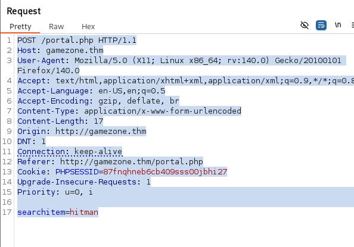
  
Ensuite, je passe la commande SQLmap suivante qui va lancer en fond tout un tas de requêtes intégrées et qui peuvent relever les structures et les contenus des bases de données. 


```
sqlmap -r request.txt --dbms=mysql --dump
```


Après avoir recueilli la table des jeux référencés sur le site, le programme retrouve un hash de mot de passe ainsi qu'un nom d'utilisateur assez évident. 


*In the users table, what is the hashed password?* 
*What was the username associated with the hashed password?* 
*What was the other table name?* 

 


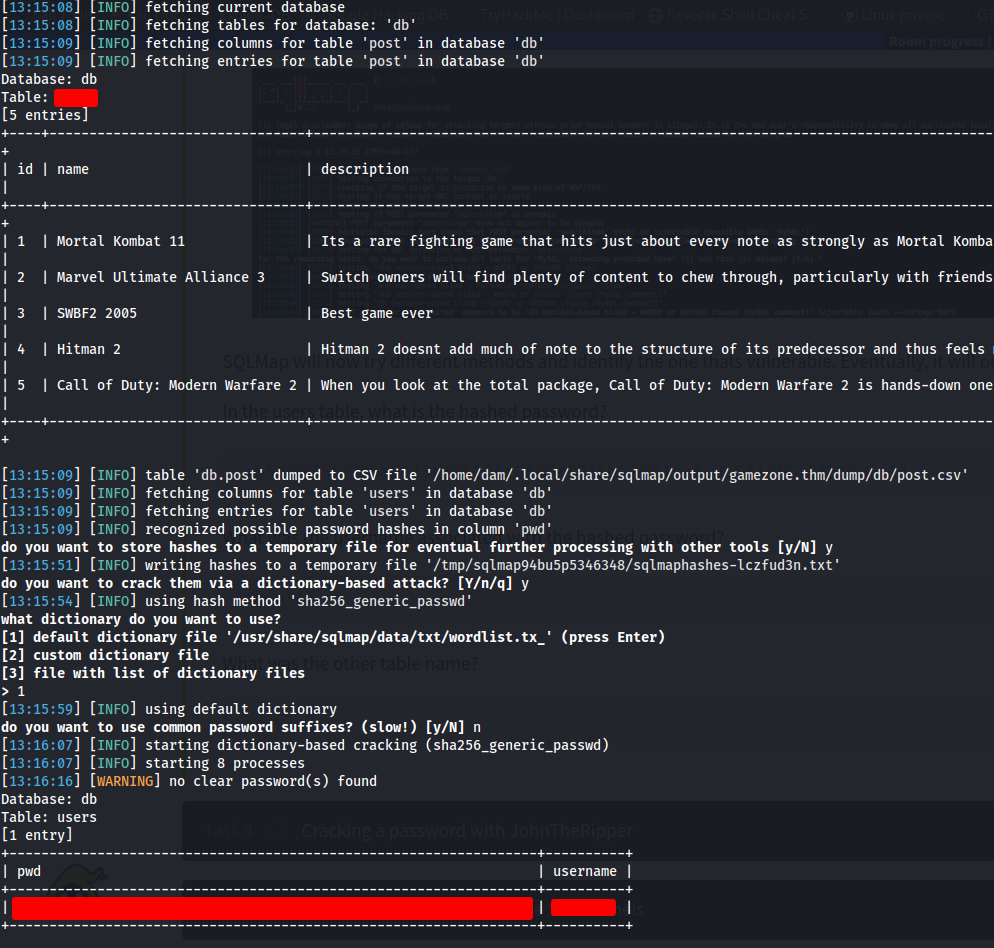
  


*What is the de-hashed password?* 

 


Compte-tenu de la difficulté de la room, inutile de dégainer john the ripper, un simple passage sur [https://hashes.com](https://www.linkedin.com/redir/redirect?url=https%3A%2F%2Fhashes%2Ecom&urlhash=gxYo&trk=article-ssr-frontend-pulse_little-text-block) suffit à trouver le mot de passe. 


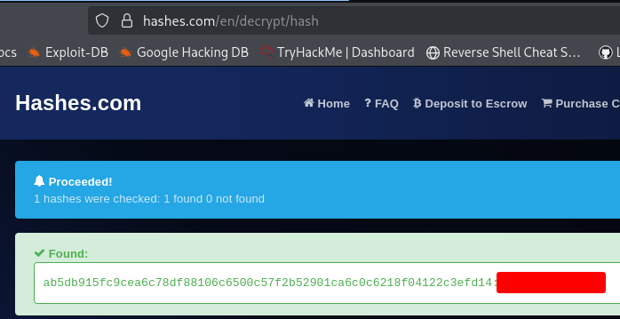
  


*What is the user flag?* 

 


On a maintenant tout ce qu'il faut pour s'identifier via le port SSH et obtenir le flag attendu. 


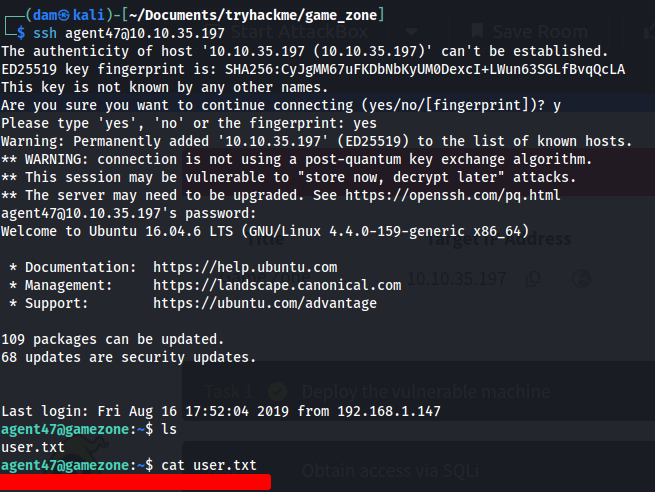
  
J'en arrive enfin à une nouvelle partie de mon apprentissage. Le tunneling SSH permet de notamment de contourner un parefeu et la room nous détaille les différentes étapes. Mais plutôt que recopier bêtement, autant comprendre ce qui se passe et pour cela, j'ai trouvé une excellente ressource sur [stackoverflow](https://www.linkedin.com/redir/redirect?url=https%3A%2F%2Fstackoverflow%2Ecom%2Fquestions%2F5280827%2Fcan-someone-explain-ssh-tunnel-in-a-simple-way&urlhash=QPzP&trk=article-ssr-frontend-pulse_little-text-block) que je vous recommande. 


*How many TCP sockets are running?* 

 


J'en reviens à THM et je lance la commande indiquée pour identifier les connexions ouvertes. On trouve deux ports avec de l'UDP et cinq avec du TCP. 


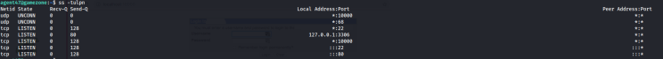
  
Sur ma machine kali maintenant, je me connecte en créant un tunnel via le port 10000 qui est ouvert en écoute sur la machine distante (l'ip a changé car j'ai du rebooter entre temps). 


```
ssh -L 10000:localhost:10000 agent47@10.10.120.94
```


Et en me connectant via le navigateur, j'arrive sur une page de connexion. 


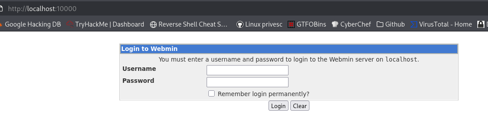
  


*What is the name of the exposed CMS?* 
*What is the CMS version?* 

 


On réutilise les identifiants qu'on a utilisés jusqu'ici et on trouve le nom du service demandé ainsi que sa version. 


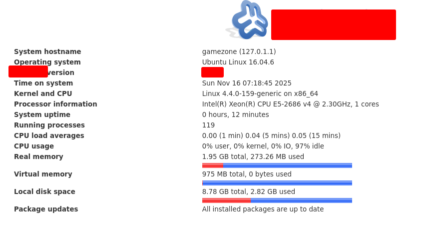
  


*What is the root flag?* 

 


Pour cette dernière question, on va utiliser Metasploit. On lance le programme avec la commande msfconsole puis search suivi du service ci-dessus. On a plusieurs options disponibles, je choisis le 0. 


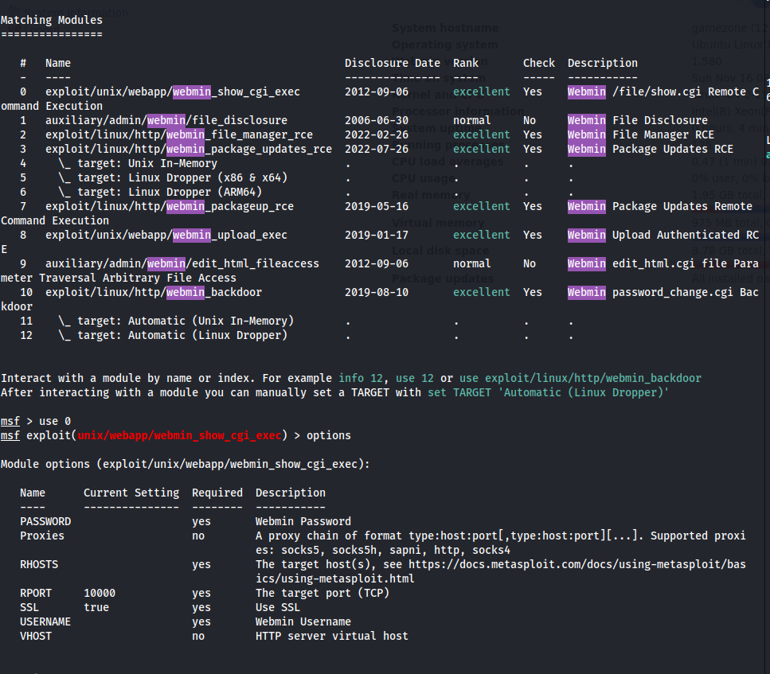
  
Pour le paramétrage, j'ai pas mal tourné autour. Déjà, le payload n'est pas indiqué, il faut s'en charger soi même. Ensuite, le RHOSTS n'est pas l'ip de la room mais bien le [localhost](https://www.linkedin.com/redir/redirect?url=http%3A%2F%2Flocalhost&urlhash=qDzA&trk=article-ssr-frontend-pulse_little-text-block) puisqu'on passe par le tunnel. Enfin, il faut désactiver le SSL. Je résume : 


```
set PASSWORD <mot de passe>
set RHOSTS localhost
set SSL false
set USERNAME <username>
set PAYLOAD payload/cmd/unix/reverse
```


Metasploit se lance et crée une session qui permettra de retrouver le flag root. 


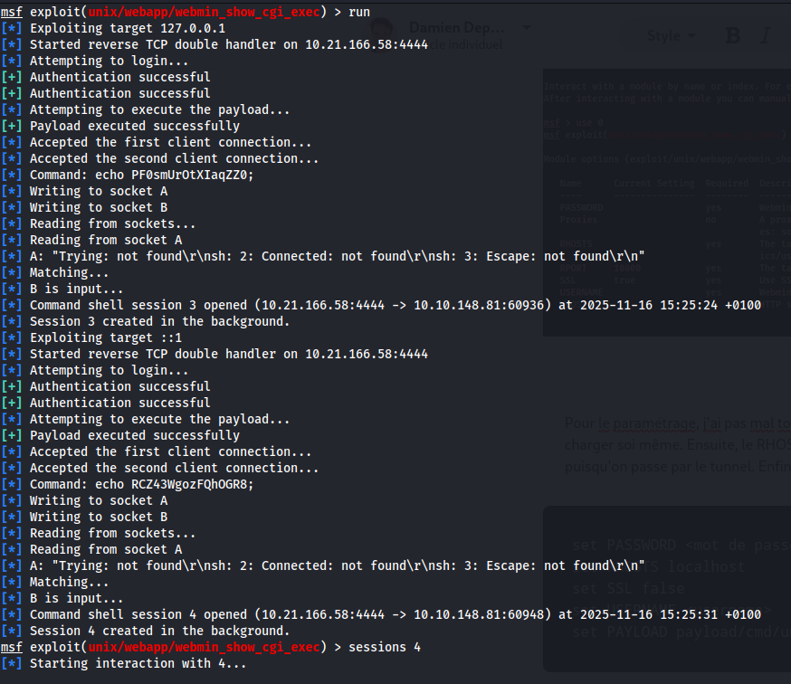
  
Je lance la session et navigue vers le répertoire root où se trouve le flag ! 


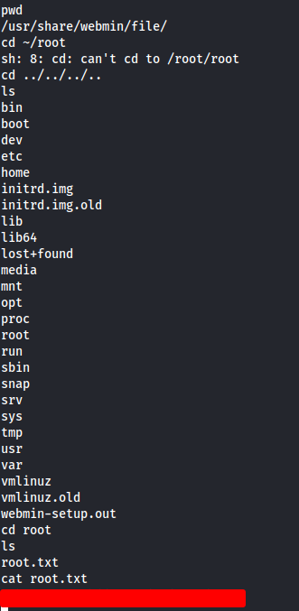
  
Au bilan, je dois être honnête, c'était pas fou. Le début était trop simple et la fin qui repose sur du metasploit, je ne suis pas très fan. Ca a quand même été l'occasion de découvrir le ssh tunneling que je ne connaissais pas encore. On verra si j'aurai plus de chance sur la room suivante !  


