**Author:** [Damien D.](https://fr.linkedin.com/in/damien-d-9816121a9)

---

# **Guide/WriteUp [FR] - TryHackMe : Goldeneye**

Ayant grandi avec le jeu vidéo sur Nintendo64, il était logique que je me lance sur [cette room](https://www.linkedin.com/redir/redirect?url=https%3A%2F%2Ftryhackme%2Ecom%2Froom%2Fgoldeneye&urlhash=zALD&trk=article-ssr-frontend-pulse_little-text-block) qui est cette fois de difficulté medium ! Croisons les doigts pour que tout se passe bien ! 

Première étape avant les scans, voir ce qui se trame sur la page une fois l'ip acquise. Ok, on a une adresse qui ouvre une fenêtre popup pour s'identifier et une faute de frappe "naviagate". 

Le texte s'affiche de manière dynamique et via F12, on voit qu'il y a un script javascript derrière. Allons voir ça tout de suite ! 

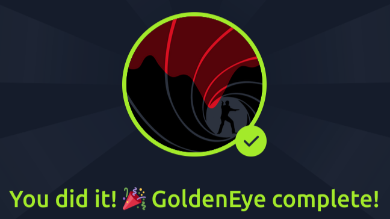
  

*Who needs to make sure they update their default password?* 

 

Ca commence pas mal ! On récupère potentiellement deux noms d'utilisateurs : Boris et Natalya (pas étonnant quand on a le film en tête !). 

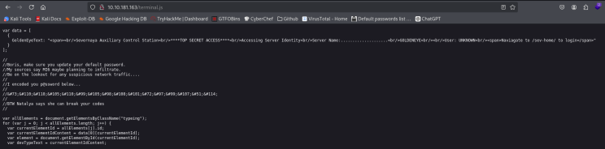
  

*Whats their password?* 

 

Un petit passage par cyberchef plus tard, on a les identifiants complets pour Boris. Je remarque au passage que le "naviagate" devait bien être une coquille vu l'orthographe douteuse dans la question. 

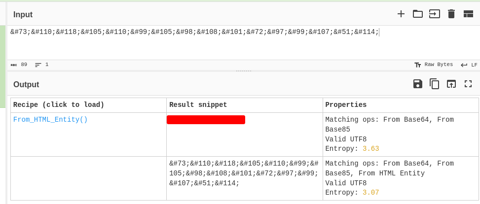
  
Une fois connecté, on obtient plus d'informations : Natalya et Boris sont tous les deux Supervisors et ils sont censés recevoir des mails des GNO (Goldeneye Network Operators) qui souhaitent suivre une formation leur permettant de devenir administrateurs. On nous dit également que le serveur mail (POP3) n'est pas sur le port habituel (110 ou 995 selon s'il est sécurisé ou non). C'est parti pour une énumération de ports avec Nmap et je vais en profiter pour faire un passage de Gobuster. 

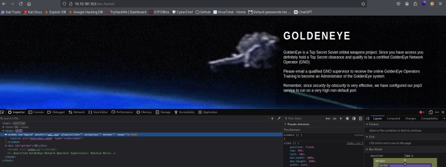
  

*Use nmap to scan the network for all ports. How many ports are open?* 

 

Le scan gobuster ne donne rien de bien palpitant, j'y reviendrai plus tard si nécessaire. Du côté de Nmap, c'est plus intéressant et surtout, on peut répondre à la première question. 

  

*If those creds don't seem to work, can you use another program to find other users and passwords? Maybe Hydra?Whats their new password?* 

 

Le port 55006 ne donnant rien, j'utilise Telnet sur le port 55007. L'identifiant de Boris est bien reconnu (Natalya aussi) mais pas son mot de passe. On va voir ce que ça donne avec Hydra. Ici, j'ai eu quelques difficultés : j'ai essayé telnet://<IP> mais ça ramait beaucoup et rockyou était bien trop massif pour un mdp dont on sait qu'il est insécure. J'ai donc changé ma syntaxe et ma wordlist avant d'essayer avec les 2 utilisateurs. Bonne nouvelle, on obtient facilement les deux credentials. 

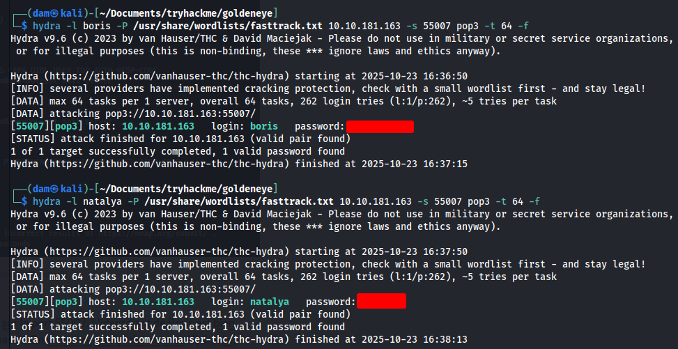
  

*Inspect port 55007, what service is configured to use this port?* 
*What can you find on this service?* 

 

Les questions arrivent un peu tard puisqu'on l'utilise depuis tout à l'heure...  

*Using the users you found on this service, find other users passwords* 
*Keep enumerating users using this service and keep attempting to obtain their passwords via dictionary attacks.* 

 

C'est déjà réglé depuis un moment mais en lisant les mails, on trouve d'autres utilisateurs potentiels (alec, janus, root, xenia). Par acquit de conscience, je relance Hydra sur tous ces utilisateurs mais ça ne donne rien, la question concerne sans doute Natalya pour qui j'ai déjà la réponse. En continuant de lire les mails, on peut voir qu'il y a effectivement eu des échanges de mots de passe concernant Xenia. 

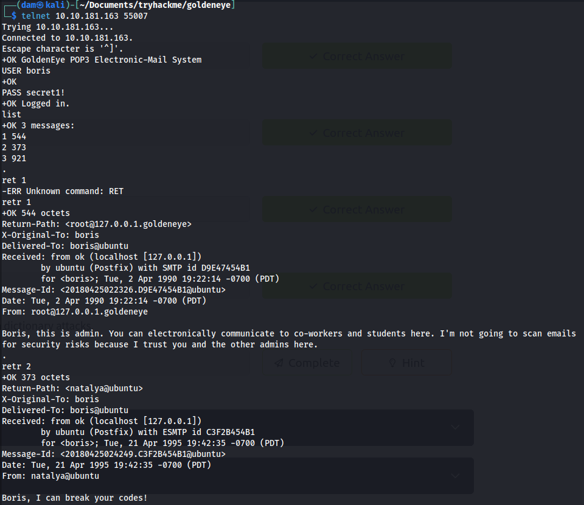
  

  
En se connectant cette fois avec les identifiants de Natalya, on trouve de quoi se logger en tant que Xenia ! Et les amateurs et amatrices du jeu apprécieront la référence au RCPC90 ainsi que cette trahison de Boris... 

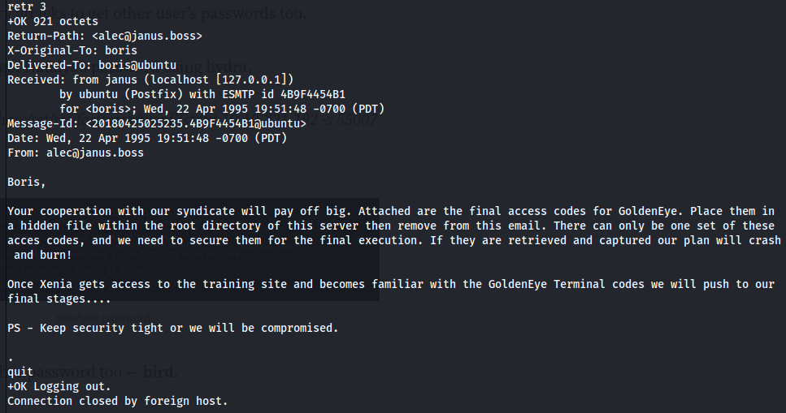
  

*Try using the credentials you found earlier. Which user can you login as?* 

 

Je mets à jour le fichier hosts comme requis et on continue avec Xenia. 

*Have a poke around the site. What other user can you find?* 

 

Sur la droite de la page, on voit un "admin" mais en fouillant un peu dans le compte, on trouve aussi Dr Doak ! 

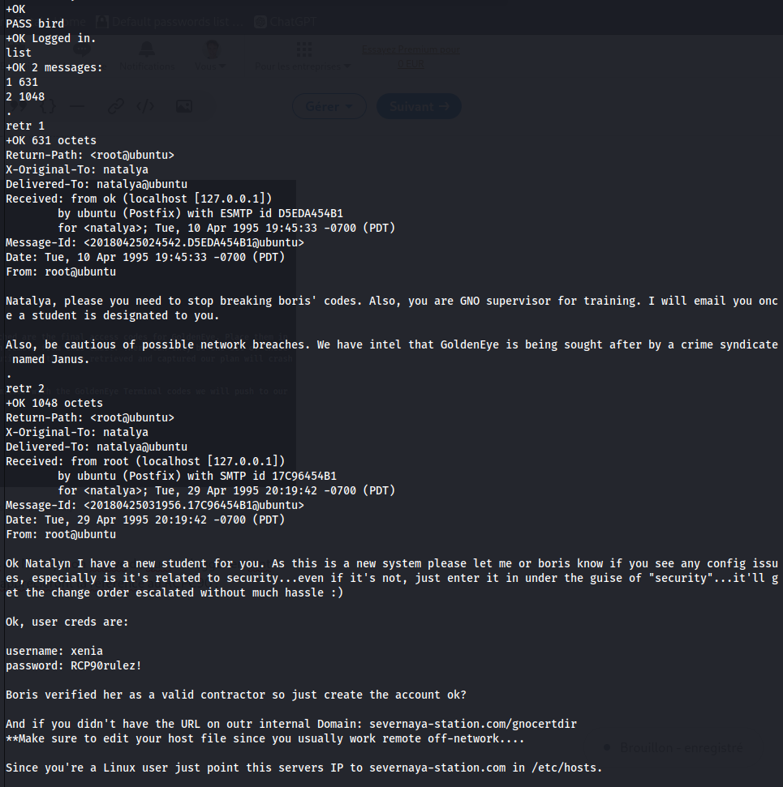
  

*What was this users password? * 

 

On relance la même commande hydra et on trouve ce qu'on veut. 

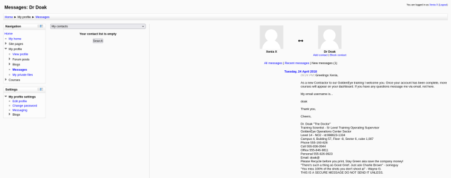
  

*Use this users credentials to go through all the services you have found to reveal more emails.* 
*What is the next user you can find from doak?* 
*What is this users password?* 

 

On revient sur telnet avec les credentials qu'on vient de trouver. 

  
Après s'être identifié sur le moodle avec ces nouveaux identifiants, on peut voir à droite qu'il y a un fichier partagé pour James. On y trouve une url qui devrait nous mener un peu plus loin. 

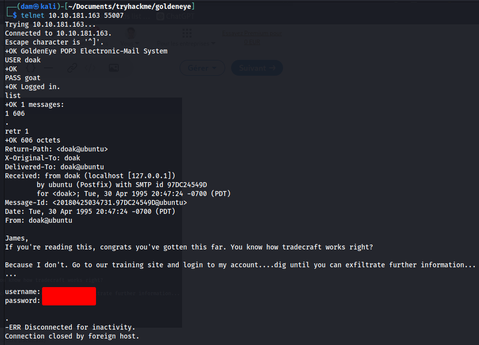
  
Aaaaah ! Que de souvenirs ! Le fameux docteur nous donne donc une clé... En réalité, la clé est l'image elle-même. Vérifions ses métadonnées via exiftools... 

  
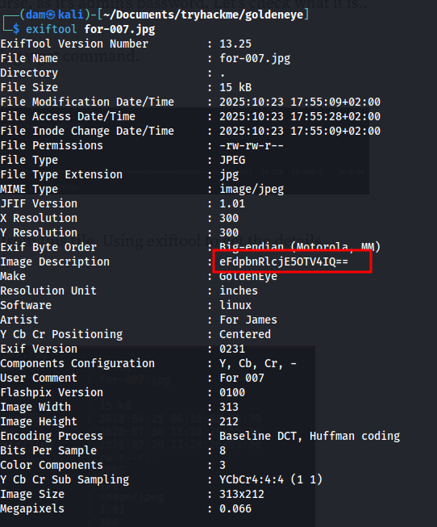
  

*Using the information you found in the last task, login with the newly found user.* 

 

De la base... 64 (étonnant non ?) qui nous donne de quoi se logger en tant qu'admin ! 

  
Pour la suite, ça devient un peu plus technique puisqu'on va exploiter un plugin pour obtenir un reverse shell. Heureusement, on nous guide en précisant le plugin mais si on cherche Aspell, on ne trouve rien. Il faut passer par la barre de recherche et j'utilise un oneliner python tiré du fameux [pentestmonkey](https://www.linkedin.com/redir/redirect?url=https%3A%2F%2Fpentestmonkey%2Enet%2Fcheat-sheet%2Fshells%2Freverse-shell-cheat-sheet&urlhash=nPSS&trk=article-ssr-frontend-pulse_little-text-block). En même temps, je lance un listener netcat sur ma machine. 

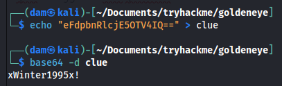
  
Ensuite je suis allé un  peu vite en besogne. J'ai tenté d'écrire un post et provoquer une correction automatique mais sans que je sache pourquoi, tout a planté. Tant et si bien que j'ai du relancer la machine complètement! Ca a été l'occasion de remarquer que le mot de passe admin était de nouveau une référence au jeu puisqu'il est sorti en hiver 1995. 

Donc, l'étape qui me manquait était d'activer le correcteur orthographique pour qu'il remplace celui par défaut qui pointait vers google. 

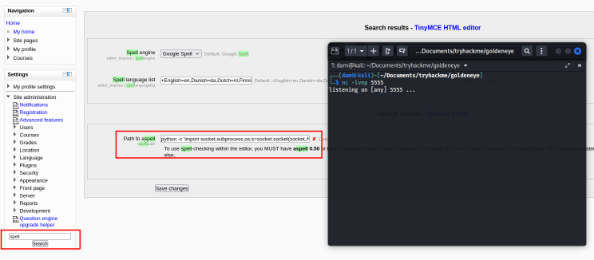
  
Et en effet, cette fois ça marche ! 

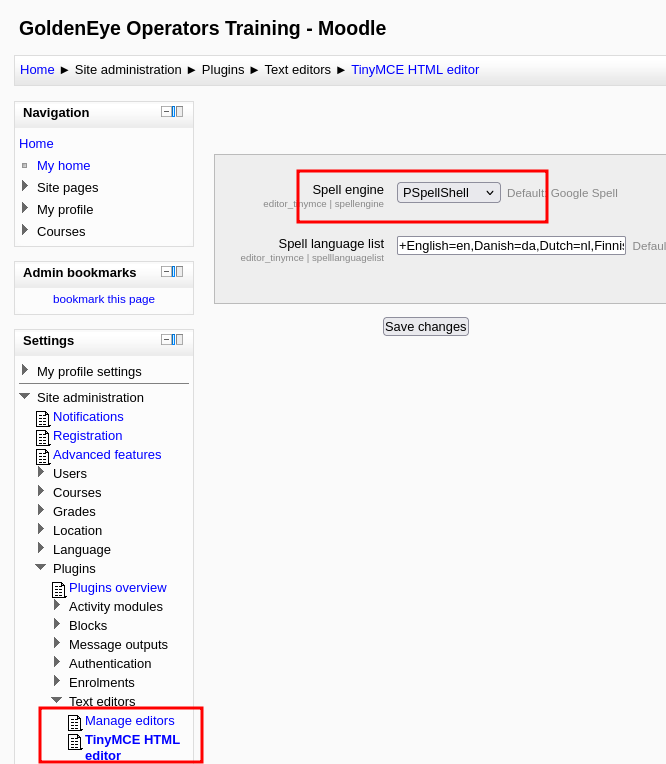
  

*Whats the kernel version?* 

 

Le descriptif de la room invite à énumérer par soi-même ou à passer par un script python à lancer sur la machine. Pour la version du kernel, il suffit d'utiliser uname -a pour obtenir la réponse. 

  
Pour ascension de privilège, ça a été beaucoup plus compliqué. J'ai souhaité me débrouiller par moi-même en énumérant les binaires auxquels j'avais accès en croisant les doigts pour que GTFOBins m'aide à aller plus loin. Malheureusement, ça n'a rien donné. Idem, on ne peut plus s'identifier avec nos personnages et on en reste avec ce www-data qui ne nous aide pas beaucoup. Rien d'intéressant du côté de crontab non plus. 

Un peu par dépit, je suis la méthode demandée qui devrait m'orienter vers une faille identifiée. Je télécharge le [linuxprivchecker.py](https://www.linkedin.com/redir/redirect?url=http%3A%2F%2Flinuxprivchecker%2Epy&urlhash=iT1E&trk=article-ssr-frontend-pulse_little-text-block) sur ma machine et lance un serveur python pour rappatrier tout ça dans la machine distante. De son côté, je me rends dans le dossier /tmp et je lance wget pour télécharger la ressource. En lançant le script avec python3, je me retrouve avec une erreur de syntaxe, je relance donc avec python2 et ça fonctionne. 

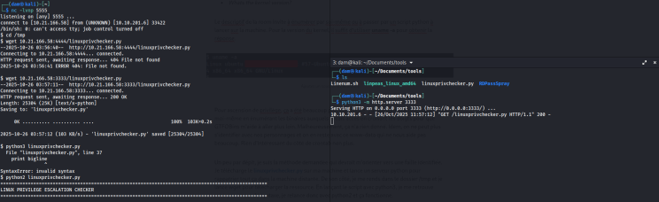
  
On nous renvoie vers plusieurs exploits de la faille Overlayfs, ça me rassure un peu car cela signifie que mes méthodes basiques d'ascension de privilège n'étaient d'aucune utilité. On est sur quelque chose de bien plus technique que je n'aurais pas pu trouver par moi-même. La suite consiste à touver l'exploit parmi ceux proposés qui fonctionnera. Même méthode, je télécharge les différents scripts sur ma machine et les envoie un à un sur le serveur pour les essayer l'un après l'autre en croisant les doigts. 

La plupart des exploits sont en c donc on ne peut pas les lancer comme un simple script python : il faut les compiler d'abord. Je fais quelques recherches et constate que le compileur le plus populaire est gcc mais il n'est pas disponible sur la machine. En revanche, on en a un autre : cc. 

Pour chaque exploit, je commence donc par compiler (cc <nomduscript> -o <nomcompilé>), j'ignore les erreurs car je n'ai pas les capacités pour les résoudre à ce jour, et je teste. C'est finalement l'exploit 37292 qui va fonctionner. 

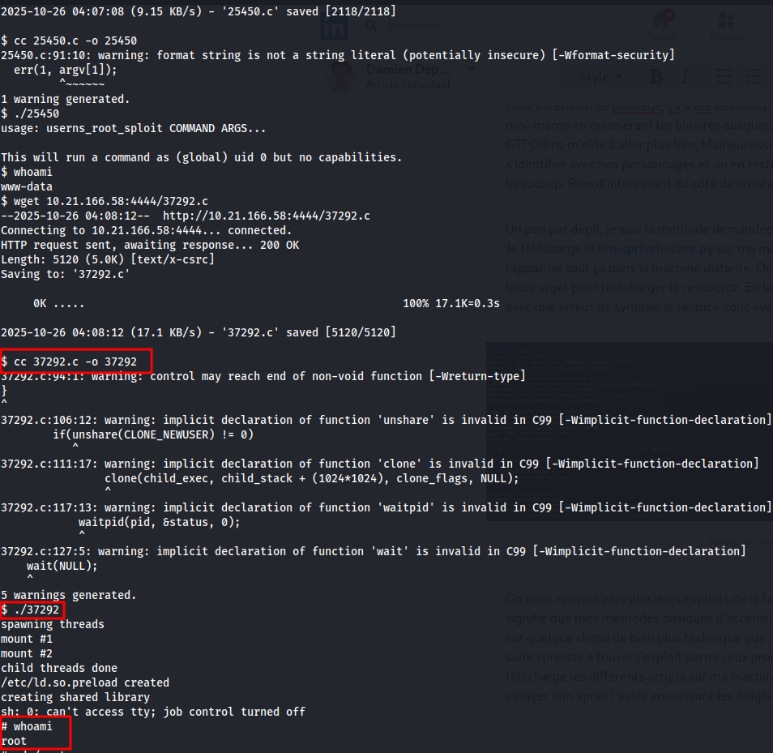
  
Et le flag est en fichier caché dans le répertoire root ! Mission accomplie ! 

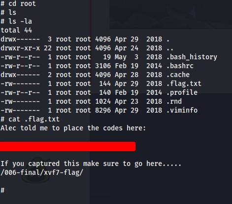
  
Et histoire de nous récompenser, on nous offre également un lien vers la fameuse scène finale ! 

  
Alors ! Que tirer de cette room niveau intermédiaire ?  

Le nombre d'étapes à franchir pour arriver au bout, ce qui donne un joli panel de choses à tester avec beaucoup de variété.  
Très bonne room en ce qui me concerne aussi pour aborder le c et les compileurs que je n'avais pas encore abordés dans mon parcours. 
Un peu d'univers pour rendre le tout ludique, ça se prend! 
Et un peu d'approfondissement de mon côté sur les types de terminaux parce que j'ai fait planter plusieurs fois le serveur à cause de mauvaises manips. 

 

Et si je devais apporter une critique, ce serait celle-ci : les indications sont trop désordonnées et/ou donnent trop d'éléments. Si l'aide finale était nécessaire (encore que, peut-être que linpeas aurait suffit), j'ai trouvé la plupart des réponses avant qu'on ne me les demandait, ce qui a rendu la rédaction de ce write-up un peu pénible. 

Très bon ressenti général malgré tout ! 

