<div align="center">

# **WriteUp/Guide [FR] - TryHackMe : Jack-of-All-Trades**

</div>

**Author:** [Damien D.](https://fr.linkedin.com/in/damien-d-9816121a9)

---

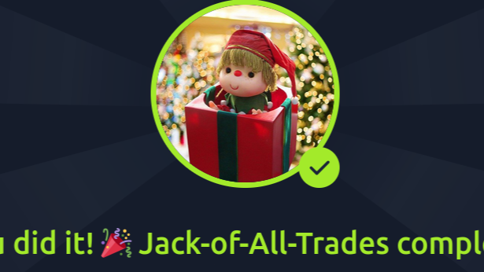


C'est parti pour un premier guide pas à pas sur un lab de 
  [TryHackMe](https://uk.linkedin.com/company/tryhackme?trk=article-ssr-frontend-pulse_little-mention)
   ! 


[https://tryhackme.com/room/jackofalltrades](https://www.linkedin.com/redir/redirect?url=https%3A%2F%2Ftryhackme%2Ecom%2Froom%2Fjackofalltrades&urlhash=ea9C&trk=article-ssr-frontend-pulse_little-text-block) 


Première étape, un scan des ports. Pas de nom de domaine alors je pense à inclure le -n pour rendre le scan plus rapide. Résultat : un port 22 et un port 80. 


  
On remarque que les ports sont inversés : le ssh est sur le 80 (je le laisse de côté pour le moment) et le http sur le 22. Et en effet, quand on essaie avec firefox, ça coince. 


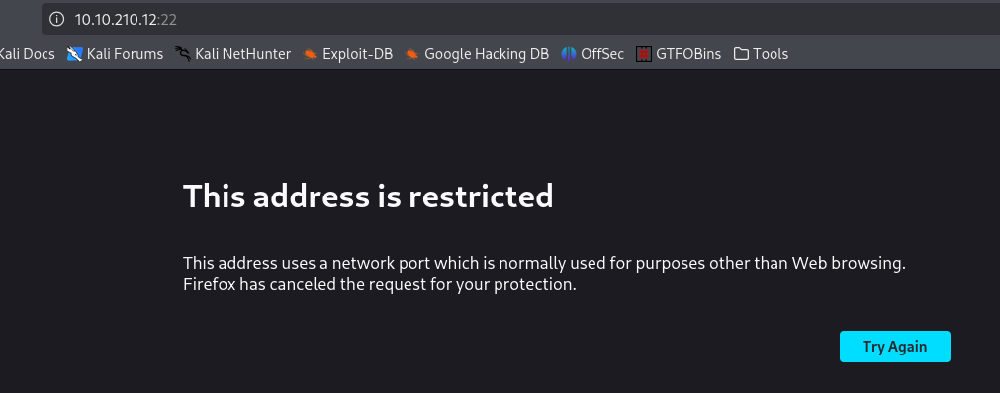
  
J'ai dû chercher un peu et il faut forcer firefox à afficher la page en modifiant un paramètre. Pour cela, rendez-vous sur about:config et on ajoute la ligne network.security.ports.banned.override et le port 22 


  
Pendant que Nmap tournait, j'ai aussi lancé un gobuster sur l'adresse, histoire de voir si on trouvait des répertoires ou des pages .php et là, bingo. Je mets ça de côté. 


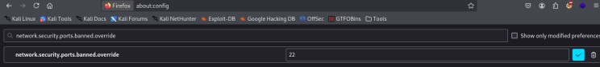
  
Je reviens à la page d'accueil que j'affiche avec les commentaires (F12) : re bingo avec ce qui ressemble à de la base 64. 


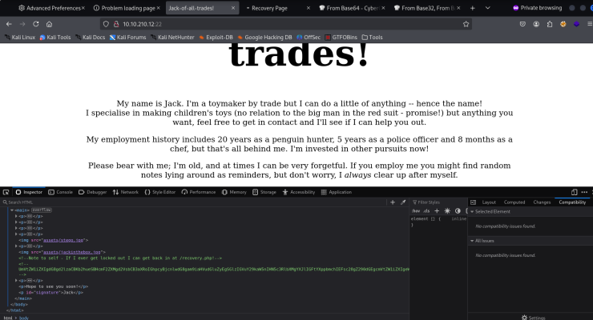
  
Commentaire qu'on pouvait aussi trouver avec un petit curl suivi de l'ip, d'ailleurs. 


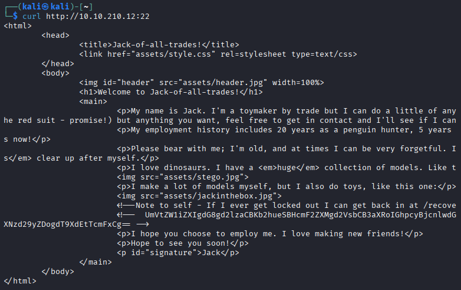
  
La page /recovery.php affiche un formulaire de login, pas impossible que la chaine en base64 soit utile ici. En attendant, voyons ce que ça donne dans Burp avec son repeater. 


  
De nouveau, une chaine de caractère mais qui ne semble pas être de la base64 cette fois. Avant d'aller plus loin, on va voir ce que donnent ces fameuses chaines de caractères. 


  
Direction Cyberchef pour y voir plus clair et bingo, on a un mot de passe. 


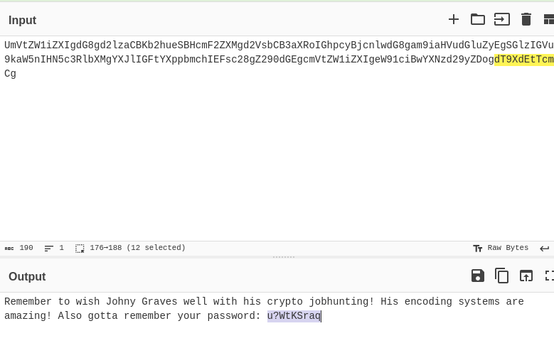
  
Sauf que le Username Jack ne donne rien avec de mot de passe, il va falloir décoder l'autre chaine de caractères mais avant ça, il faut trouver l'encodage. 


Un = pour compléter la longueur, des minuscules et majuscules mélangées, des chiffres de 2 à 7 : on est en base32. Voyons voir ce que ça donne sur Cyberchef. 


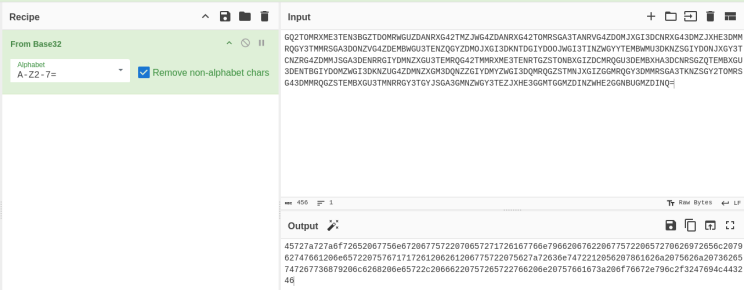
  
Minuscules de a à f et chiffres de 0 à 9 ? C'est de l'hexadécimal. On ajoute un filtre. 


  
Haha ! Magnifique ! L'url ressemble à du [bit.ly](https://www.linkedin.com/redir/redirect?url=http%3A%2F%2Fbit%2Ely&urlhash=l2mJ&trk=article-ssr-frontend-pulse_little-text-block), ça sent le chiffrement César. En fouillant un peu, j'apprends que [le décalage de 13 caractères a des particularités et qu'il est donc parfois employé](https://fr.wikipedia.org/wiki/ROT13?trk=article-ssr-frontend-pulse_little-text-block). Mieux que ça, il est aussi pris en compte sur Cyberchef. Quant à ce fameux Johnny Graves dont il était question dans le commentaire, une recherche mène vers un myspace qui mentionne aussi ce ROT13. 


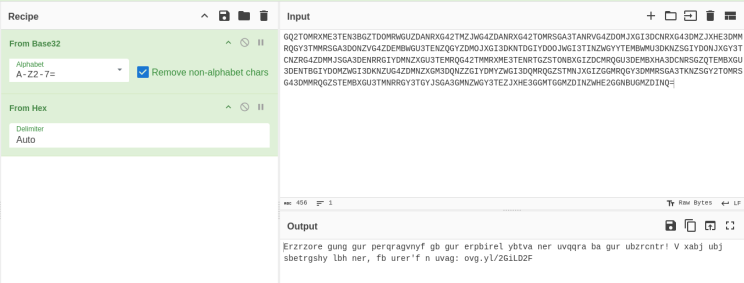
  
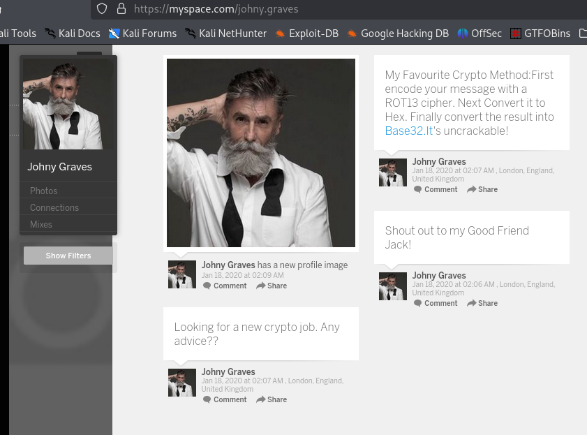
  
Le lien nous renvoie sur une page wiki consacrée au stégosaure dont il y avait un dessin sur la page d'accueil du site. Pourtant le login ne passe pas avec stego, stegosauria ou stegosaurius. Peut-être que l'image de la page d'accueil cache quelque chose, autant vérifier. Pendant ce temps, autant lancer un petit Hydra, ça ne mange pas de pain surtout que je connais le message d'erreur : 


```
hydra -V -L /usr/share/wordlists/SecLists/Usernames/Honeypot-Captures/multiplesources-users-fabian-fingerle.de.txt  -p 'u?WtKSraq' 10.10.210.12 -s 22 http-post-form "/recovery.php:user=^USER^&pass=^PASS^:Hello Jack! Did you forget your machine password again?.."
```


Strings ne donne rien sur les 3 images de la page d'accueil et je ne vois rien de suspect sur [hexed.it](https://www.linkedin.com/redir/redirect?url=http%3A%2F%2Fhexed%2Eit&urlhash=6B6w&trk=article-ssr-frontend-pulse_little-text-block). Je cherche quand même du côté de la stéganographie parce que l'indice est quand même très insistant et je découvre que Kali intègre un outil qui va s'avérer très utile. 


  
Cet outil c'est [stegseek](https://www.linkedin.com/redir/redirect?url=https%3A%2F%2Fgithub%2Ecom%2Fgitonga-stealth%2Fstegseek&urlhash=LFc9&trk=article-ssr-frontend-pulse_little-text-block) qui permet de retrouver des informations cachées. Quelques recherches plus tard et tentatives infructueuses, je trouve les bons flags :  


```
stegseek --extract -sf stego.jpg
```


Mais une room sans trolling, n'est pas une bonne room... Heureusement, j'avais téléchargé les 3 images disponibles. 


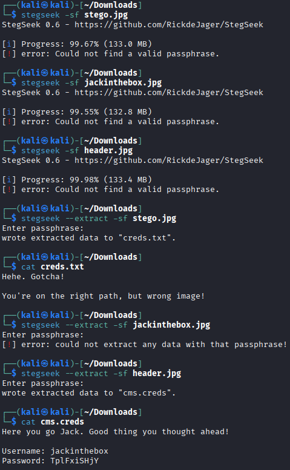
  
Je pensais en avoir fini mais non ! On s'oriente vers de la command injection... 


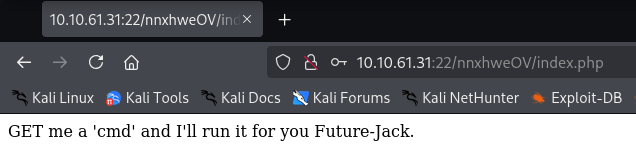

Redémarrage de la machine entre temps donc nouvelle ip 


Alors c'est parti pour les commandes de base : whoami, pwd... En remontant l'arborescence, je finis par tomber sur quelque chose d'intéressant. 


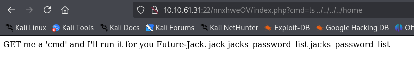
  
Ça fonctionne avec cat mais je me dis que c'est la bonne occasion de travailler la stabilité d'un shell. La commande "which netcat" fonctionne donc on va pouvoir l'utiliser pour communiquer avec notre machine attaquante. 


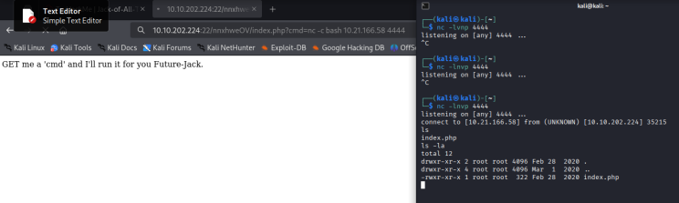
  
Et retrouver ce fichier et le sauvegarder sur ma machine. Un ctrl+shift+c et un nano plus tard... 


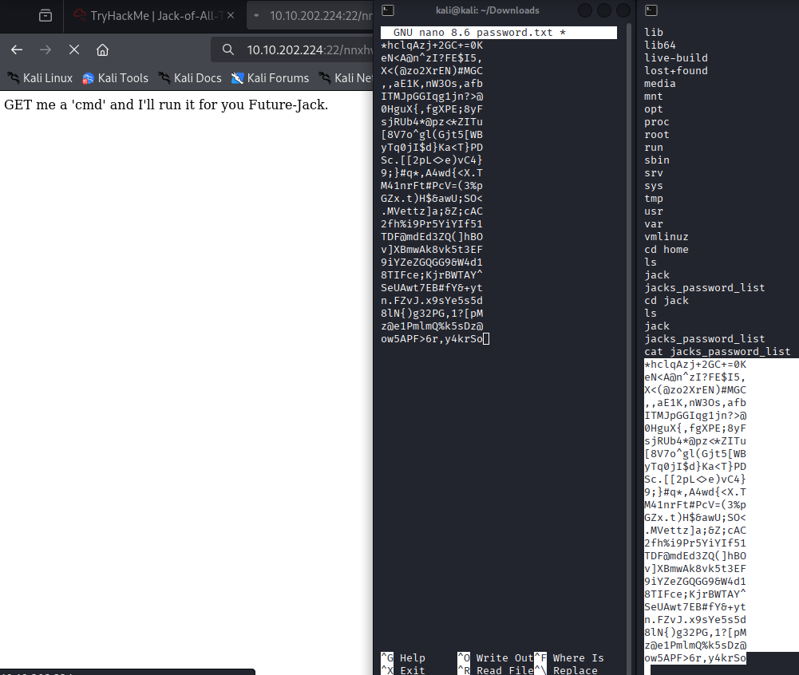
  
Comme on a affaire à une liste de mots de passe, je choisis de passer par hydra. Au moment de la connexion ssh, il faut penser à préciser le port 80. Je pensais en avoir enfin terminé mais non, il faut rapatrier un user.jpg... 


  
Je monte un serveur en python rapidement (c'est du python 2.7 donc le module n'est pas http.server mais SimpleHTTPServer (en respectant la casse)) et j'utilise wget pour récupérer le fichier sur ma machine, il contient le user flag. 


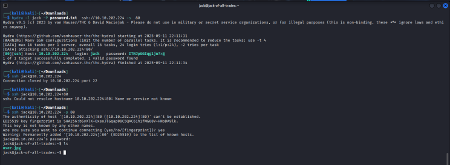
  
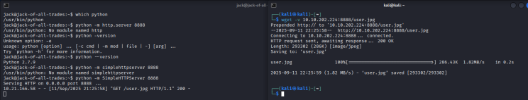
  
Mais on n'est pas root, or il nous faut le second flag. D'expérience, il est dans un fichier root.txt dans le dossier root (chose confirmée a posteriori dans l'indice). On liste les binaries auxquels on a accès et, coup de bol (room facile), strings en fait partie ! On utilise ça et c'est terminé ! 


  
Et voilà pour cette room débutant ! Pas mal de choses intéressantes ici. Rien de bien difficile mais c'est plutôt varié niveau outils et notions. J'espère que ça vous aura été utile ! 


