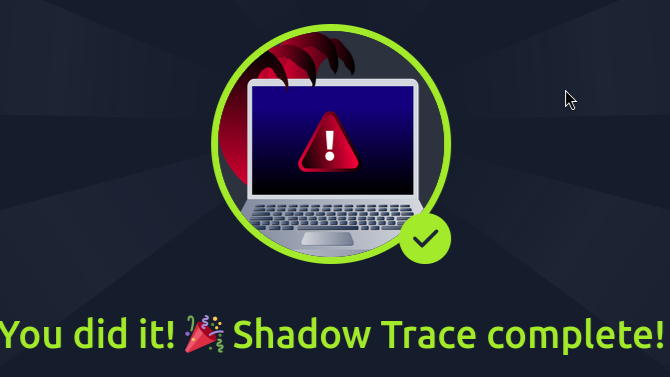
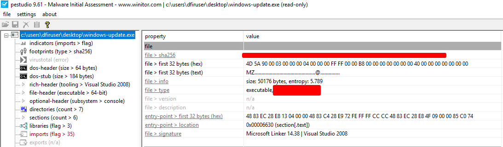
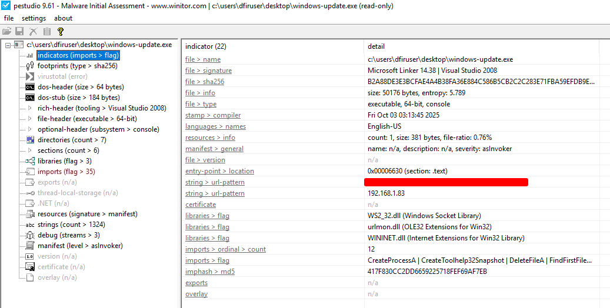
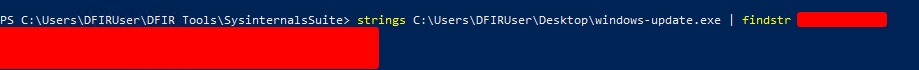
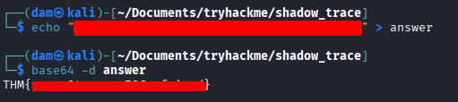
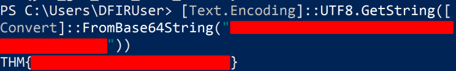
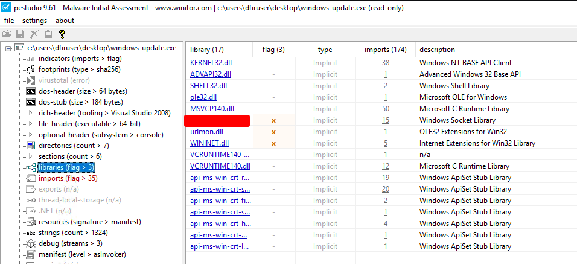
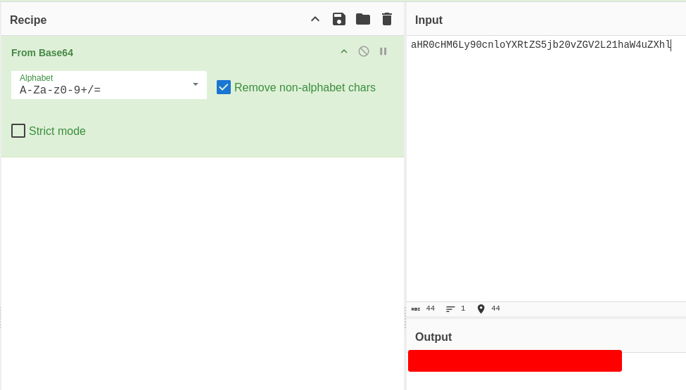
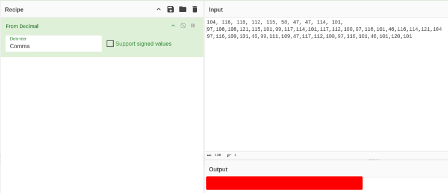
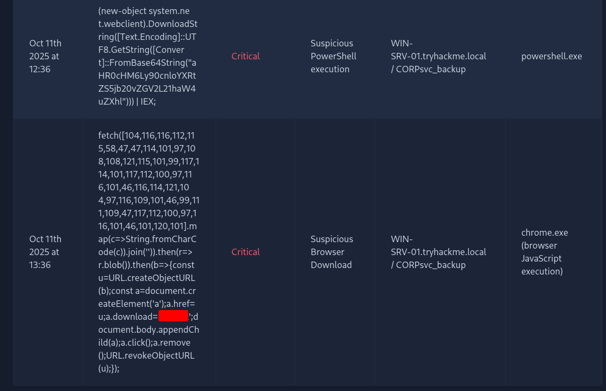

**Author:** [Damien D.](https://fr.linkedin.com/in/damien-d-9816121a9)

---

  

  

WriteUp/Guide [FR] - TryHackMe : Shadow Trace

J'ai plutôt tendance à travailler sur des rooms assez anciennes histoire d'avoir un petit filet de sécurité mais cette fois, je me suis lancé sur une qui vient de sortir : [https://tryhackme.com/room/shadowtrace](https://www.linkedin.com/redir/redirect?url=https%3A%2F%2Ftryhackme%2Ecom%2Froom%2Fshadowtrace&urlhash=aqyD&trk=article-ssr-frontend-pulse_little-text-block)  

Rien de bien méchant au programme, une simple analyse de malware qu'on peut faire entièrement grâce à pestdudio, strings et un petit détour par cyberchef. 

What is the architecture of the binary file windows-update.exe? 
What is the hash (sha-256) of the file windows-update.exe? 

 

Première étape, se rendre dans le dossier sur le bureau et ouvrir le fichier windows-update.exe dans pestudio. Rien qu'avec ça, on obtient les deux premières réponses. 

  

Identify the URL within the file to use it as an IOC 

 

L'url se trouve dans la section indicators. 

  

With the URL identified, can you spot a domain that can be used as an IOC? 

 

C'est là qu'entre en jeu strings. On peut scroller la section strings en cherchant l'hôte qu'on a découvert précédemment mais autant faire plus rapide. J'ouvre Powershell et me déplace dans le dossier SysinternalsSuite dans lequel on trouve l'outil. On indique le fichier à analyser et on fait un pipe avec findstr suivi du nom d'hôte. On trouve 3 résultats dont un qui va servir pour la question suivante. 

  

Input the decoded flag from the suspicious domain 

 

Le second résultat de strings nous donne une chaine de caractères qui ressemble à de la base64. Là, on a le choix :  

option 1 (facile) : cyberchef avec from Base64 

  
option 2 (sympa à faire) : utiliser le terminal sous linux 

  
optin 3 (pénible mais qui a le mérite d'utiliser la machine hôte) : passer par powersell 

  

What library related to socket communication is loaded by the binary? 

 

Encore une fois, l'information est très explicite puisqu'il existe une section libraries. 

  
On passe à la seconde partie où il faut analyser les alertes. Rien de bien méchant une fois encore, c'est une room vraiment très accessible. La troisième question notamment peut être abordée directement en regardant la deuxième entrée puisque le fichier en question apparait en clair. 

Can you identify the malicious URL from the trigger by the process powershell.exe? 

 

Ici, l'adresse se trouve dans la première entrée mais elle est encodée en base64. On peut reprendre ce qu'on vient de faire juste au-dessus à partir de cette nouvelle chaine de caracères. 

  

Can you identify the malicious URL from the alert triggered by chrome.exe? 

 

Cette fois, la réponse est dans la seconde entrée et elle prend la forme d'une suite de nombres. L'encodage est du simple décimal mais il faut préciser que le délimiteur est une virgule (comma) sinon ça ne donne rien. On peut aussi utiliser Magic qui donne le résultat directement mais c'est toujours plus intéressant de faire les choses par soi-même ! 

  

What's the name of the file saved in the alert triggered by chrome.exe? 

 

  
Et voilà pour cette room vraiment très simple et qui rapporte pas mal de points mine de rien ! 

