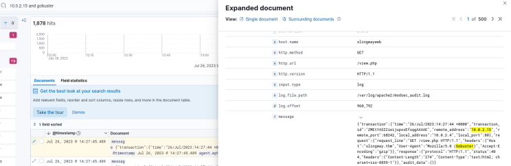
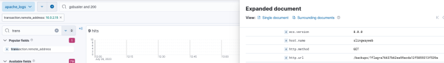
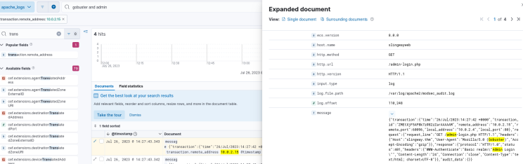
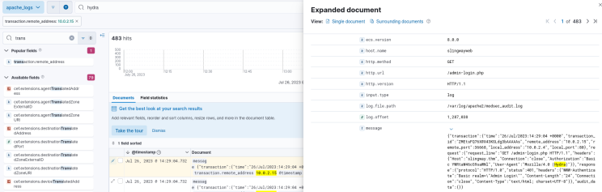
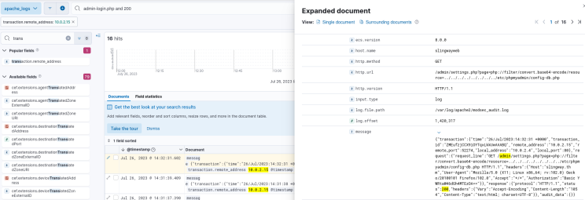
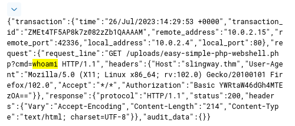
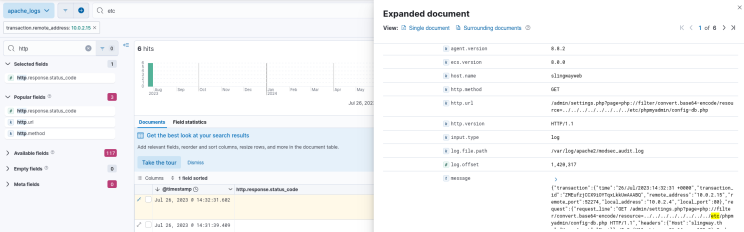
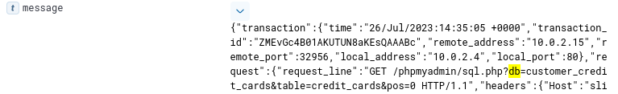
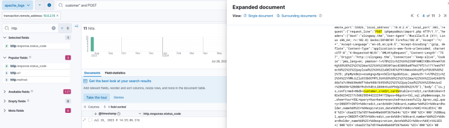

**Author:** [Damien D.](https://fr.linkedin.com/in/damien-d-9816121a9)

---

4 min read
  

  

WriteUp/Guide [FR] - TryHackeMe : Slingshot

[

              
          
        Damien D.
      
      
          
](https://fr.linkedin.com/in/damien-d-9816121a9)

  
            
        Damien D.
      
          
 
 

  

C'est parti pour un peu de blue team avec [Slingshot](https://www.linkedin.com/redir/redirect?url=https%3A%2F%2Ftryhackme%2Ecom%2Froom%2Fslingshot&urlhash=b2Ui&trk=article-ssr-frontend-pulse_little-text-block), une room dédiée au logiciel Elastic dans le module SOC II de TryHackMe. J'adore ce type d'exercice qui demande avant tout pas mal de logique et un peu d'essai/erreur. Rien de bien difficile au programme, j'ai tout retrouvé en moins d'une demi heure. Go ! 

What was the attacker's IP? 

 

La première chose à faire est de paramétrer la date pour faire apparaître l'ensemble des logs. 

  
La première question est simple puisqu'on nous demande l'IP de l'attaquant. En regardant la partie "message" des logs, on voit que l'adresse distante est indiquée par "remote_address". En le mettant dans la barre de recherche, le nom exact apparaît : transaction.remote_address. En cliquant sur le champ, on voit une ip qui sort du lot : 10.0.2.15 

What was the first scanner that the attacker ran against the web server? 

 

Quant au scan, c'est assez logique, il s'agit de nmap. Un petit 10.0.2.15 and nmap plus tard, on a notre confirmation : Nmap scripting engine 

  

What was the User Agent of the directory enumeration tool that the attacker used on the web server? 

 

Ensuite, il est question d'un programme d'énumération. A priori, on part sur du gobuster ou du ffuf. Même idée ici : 10.0.2.15 and gobuster. Une fois qu'on a trouvé ce qu'on cherche, on regarde le user agent : Mozilla/5.0 (Gobuster) 

  

In total, how many requested resources on the web server did the attacker fail to find? 

 

Maintenant, on nous demande toutes les requêtes qui ont échoué. On cherche donc les pages 404 inhérentes au bruteforce de gobuster. J'ai ajouté le champ de l'ip entre temps et il n'y a plus qu'à indiquer le code d'erreur dans la barre de recherche : il y a 1867 erreurs. 

  

What is the flag under the interesting directory the attacker found? 

 

Maintenant, on nous demande de retrouver un flag dans le répertoire trouvé grâce à gobuster. Rien de plus simple, on va chercher le code 200 et la réponse se trouve dans la fenêtre : a76637b62ea99acda12f5859313f539a 

  

What login page did the attacker discover using the directory enumeration tool? 

 

On reste sur les résultats de gobuster et on va juste ajouter le terme "admin". Le résultat le plus récent renvoie une erreur 401 qui signifie qu'on attend une identification pour accéder à la page, bingo. /admin-login.php 

  

What was the user agent of the brute-force tool that the attacker used on the admin panel? 

 

Pour ce qui est du bruteforce d'identifiants, hydra est la solution la plus simple et répandue. Tout comme nmap et gobuster, on reste sur du classique. Le user agent qui en découle est Mozilla/4.0 (Hydra) 

  

What username:password combination did the attacker use to gain access to the admin page? 

 

Ah ! Enfin une question un peu plus technique. Évidemment, les recherches type pass / password ou username ne donnent rien, ce serait trop facile. Pas grave, on passe à la deuxième solution. On va chercher une page login qui renvoie un code 200 et voir ce qu'on y trouve. 

  
La chaine YWRtaW46dGh4MTEzOA== attire l'attention. On remarque au-dessus qu'il s'agit de base64. Pour décoder ça, on peut passer par Cyberchef ou directement via l'invite de commande : admin:thx1138 

  

What flag was included in the file that the attacker uploaded from the admin directory? 

 

Une recherche du terme "upload" suffit pour tomber sur ce qui nous intéresse : THM{ecb012e53a58818cbd17a924769ec447} 

  

What was the first command the attacker ran on the web shell? 

 

Pour répondre à cette question, je n'ai pas eu besoin de faire une recherche, c'est une simple question de bon sens. Quand on débarque sur une machine, on passe toujours par la suite whoami, pwd, ls. Sans surprise, la première commande est donc whoami 

  

What file location on the web server did the attacker extract database credentials from using Local File Inclusion? 

 

Encore une fois, c'est une simple question de bon sens ici. On cherche une base de donnée sur une machine distante qui tourne probablement sous linux. On peut rechercher un terme générique db et la réponse se valide d'elle-même avec la structure de la réponse /___/ qui évoque un /etc/. J'ai choisi l'option de facilité en cherchant directement etc : /etc/phpmyadmin/config-db.php 

  

What directory did the attacker use to access the database manager? 
What was the name of the database that the attacker exported? 

 

Ici, on peut faire d'une pierre deux coups. Encore une fois, tout est question de mots clés et un simple db suffit pour trouver la solution 12 /phpmyadmin et la 13 : customer_credit_cards 

  

What flag does the attacker insert into the database? 

 

Il est question d'insérer quelque chose dans la base de donnée. J'ai donc filtré avec customer auquel j'ai ajouté la méthode POST. Comme il n'y avait qu'une dizaine de réponses, j'ai parcouru des yeux les résultats et je suis tombé sur la commande INSERT. Dans la partie VALUES, on trouve une suite de caractères suspecte. 

Pour cette dernière question, j'ai un peu tourné en rond parce que je pensais que la réponse était encodée. C'est par hasard que je me suis rendu compte que ce que j'essayais de décoder faisait exactement la longueur de la réponse attendue. Le fait que la question parle d'un message est vraiment trompeur : c6aa3215a7d519eeb40a660f3b76e64c 

  
Mission accomplie ! 

Une petite room bien plus simple que ce à quoi je m'attendais mais c'est toujours sympa d'enquêter avec Elastic ou Splunk ! 

